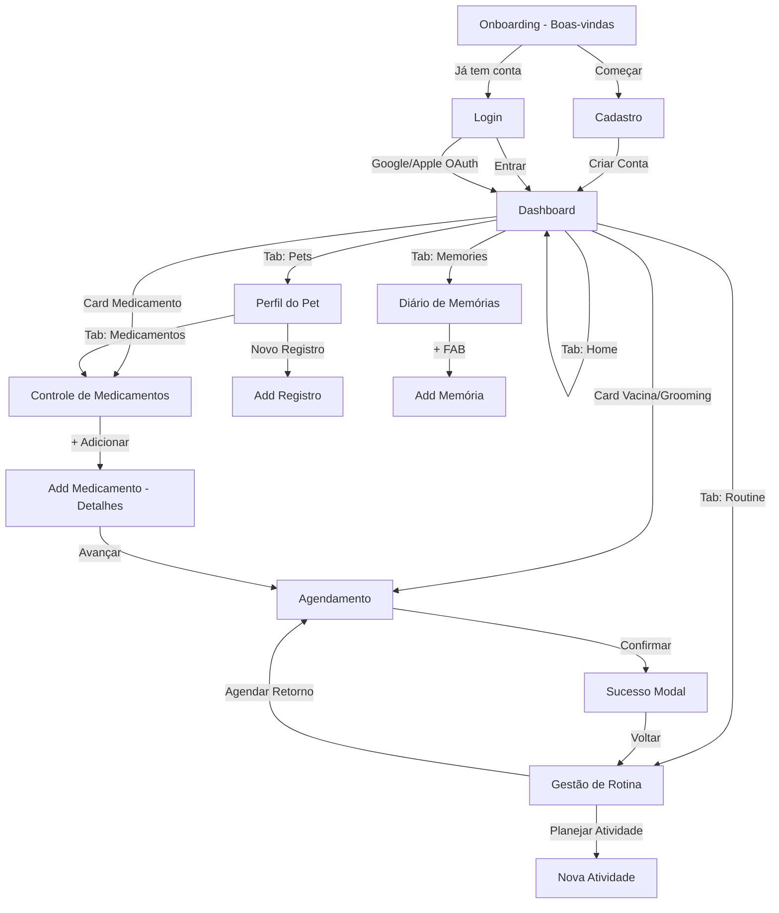

# PetLife — Design System Completo

> Documento gerado a partir da análise minuciosa de 10 telas do protótipo Stitch PetLife.  
> Inclui todos os tokens, componentes, layouts e diretrizes de implementação.  
> **Data de extração:** 2026-06-29

---

## 1. Design Tokens (CSS Custom Properties)

```css
:root {
  /* ===== CORES — Paleta Primária (Laranja-Marrom) ===== */
  --color-primary:                 #9b4500;
  --color-on-primary:              #ffffff;
  --color-primary-container:       #ff914d;
  --color-on-primary-container:    #6e2f00;
  --color-primary-fixed:           #ffdbc9;
  --color-primary-fixed-dim:       #ffb68e;
  --color-on-primary-fixed:        #331200;
  --color-on-primary-fixed-variant:#763300;
  --color-inverse-primary:         #ffb68e;
  --color-surface-tint:            #9b4500;

  /* ===== CORES — Paleta Secundária (Azul) ===== */
  --color-secondary:               #005fac;
  --color-on-secondary:            #ffffff;
  --color-secondary-container:     #5fa6fd;
  --color-on-secondary-container:  #003a6d;
  --color-secondary-fixed:         #d4e3ff;
  --color-secondary-fixed-dim:     #a4c9ff;
  --color-on-secondary-fixed:      #001c39;
  --color-on-secondary-fixed-variant: #004884;

  /* ===== CORES — Paleta Terciária (Verde-Teal) ===== */
  --color-tertiary:                #006b55;
  --color-on-tertiary:             #ffffff;
  --color-tertiary-container:      #68bda2;
  --color-on-tertiary-container:   #004b3a;
  --color-tertiary-fixed:          #9df3d6;
  --color-tertiary-fixed-dim:      #82d7bb;
  --color-on-tertiary-fixed:       #002118;
  --color-on-tertiary-fixed-variant: #00513f;

  /* ===== CORES — Superfície e Background ===== */
  --color-background:              #f7f9fb;
  --color-on-background:           #191c1e;
  --color-surface:                 #f7f9fb;
  --color-surface-bright:          #f7f9fb;
  --color-surface-dim:             #d8dadc;
  --color-surface-variant:         #e0e3e5;
  --color-on-surface:              #191c1e;
  --color-on-surface-variant:      #564339;
  --color-surface-container-lowest: #ffffff;
  --color-surface-container-low:  #f2f4f6;
  --color-surface-container:       #eceef0;
  --color-surface-container-high:  #e6e8ea;
  --color-surface-container-highest: #e0e3e5;
  --color-inverse-surface:         #2d3133;
  --color-inverse-on-surface:      #eff1f3;

  /* ===== CORES — Erro ===== */
  --color-error:                   #ba1a1a;
  --color-on-error:                #ffffff;
  --color-error-container:         #ffdad6;
  --color-on-error-container:      #93000a;

  /* ===== CORES — Bordas e Outlines ===== */
  --color-outline:                 #897267;
  --color-outline-variant:         #dcc1b4;

  /* ===== TIPOGRAFIA ===== */
  --font-display:      'Quicksand', sans-serif;
  --font-headline:     'Quicksand', sans-serif;
  --font-body:         'Plus Jakarta Sans', sans-serif;
  --font-label:        'Plus Jakarta Sans', sans-serif;

  /* ===== ESPAÇAMENTOS ===== */
  --spacing-base:            4px;
  --spacing-xs:              8px;
  --spacing-sm:              16px;
  --spacing-gutter:          16px;
  --spacing-md:              24px;
  --spacing-lg:              40px;
  --spacing-xl:              64px;
  --spacing-margin-mobile:   20px;
  --spacing-margin-desktop:  auto;
  --spacing-max-width:       1200px;

  /* ===== BORDER RADIUS ===== */
  --radius-default:    0.25rem;
  --radius-lg:         0.5rem;
  --radius-xl:         0.75rem;
  --radius-2xl:        1rem;
  --radius-3xl:        1.5rem;
  --radius-full:       9999px;

  /* ===== SOMBRAS ===== */
  --shadow-ambient-sm: 0 2px 8px -2px rgba(0, 0, 0, 0.05);
  --shadow-ambient-md: 0 4px 20px -4px rgba(0, 0, 0, 0.06);
  --shadow-card:       0 4px 20px rgba(0, 0, 0, 0.06);
  --shadow-modal:      0 8px 32px rgba(0, 0, 0, 0.12);
  --shadow-button:     0 4px 12px rgba(155, 69, 0, 0.2);
  --shadow-button-hover: 0 6px 15px rgba(155, 69, 0, 0.3);
  --shadow-button-lg:  0 8px 16px rgba(155, 69, 0, 0.2);
  --shadow-bottom-nav: 0 -4px 20px rgba(0, 0, 0, 0.06);
  --shadow-login-card: 0 4px 20px 0 rgba(0, 0, 0, 0.06);
}
```

---

## 2. Paleta de Cores Detalhada

### 2.1 Mapeamento Semântico

| Token Semântico | Valor Hex | Uso Principal |
|---|---|---|
| `primary` | `#9b4500` | CTAs principais, texto de destaque, ícone da logo |
| `on-primary` | `#ffffff` | Texto/ícones sobre fundo primary |
| `primary-container` | `#ff914d` | Fundo de botões secundários, active tabs, avatar ring |
| `on-primary-container` | `#6e2f00` | Texto sobre primary-container |
| `primary-fixed` | `#ffdbc9` | Fundo suave de elementos fixos primary |
| `primary-fixed-dim` | `#ffb68e` | Variante dimida do fixed (chips inativos) |
| `secondary` | `#005fac` | Links, focus ring, botões secundários |
| `on-secondary` | `#ffffff` | Texto sobre secondary |
| `secondary-container` | `#5fa6fd` | Cards de medicamento, badge de medicação |
| `on-secondary-container` | `#003a6d` | Texto sobre secondary-container |
| `tertiary` | `#006b55` | Status positivo, saúde em dia, gráfico |
| `on-tertiary` | `#ffffff` | Texto sobre tertiary |
| `tertiary-container` | `#68bda2` | Badge de status ativo, card de passeio |
| `on-tertiary-container` | `#004b3a` | Texto sobre tertiary-container |
| `tertiary-fixed` | `#9df3d6` | Badge Tomado no histórico |
| `surface` | `#f7f9fb` | Fundo geral das telas |
| `surface-bright` | `#f7f9fb` | Idêntico ao surface |
| `surface-dim` | `#d8dadc` | Surface escurecido (dark mode) |
| `surface-container-lowest` | `#ffffff` | Cards e modais (branco puro) |
| `surface-container-low` | `#f2f4f6` | Fundo de inputs, chips de informação |
| `surface-container` | `#eceef0` | Fundo de áreas internas, hover states |
| `surface-container-high` | `#e6e8ea` | Hover em elementos de lista |
| `surface-container-highest` | `#e0e3e5` | Separadores, barras de gráfico inativas |
| `surface-variant` | `#e0e3e5` | Borders, dividers |
| `on-surface` | `#191c1e` | Texto principal (quase preto) |
| `on-surface-variant` | `#564339` | Texto secundário, labels, placeholders |
| `inverse-surface` | `#2d3133` | Fundo de tooltips (escuro) |
| `inverse-on-surface` | `#eff1f3` | Texto em tooltips (claro) |
| `error` | `#ba1a1a` | Estados de erro, doses pendentes |
| `error-container` | `#ffdad6` | Fundo de badge de urgência |
| `on-error-container` | `#93000a` | Texto em badge de urgência |
| `outline` | `#897267` | Bordas de elementos menos destacados |
| `outline-variant` | `#dcc1b4` | Bordas suaves (cards, inputs) |
| `background` | `#f7f9fb` | Fundo global da aplicação |

### 2.2 Uso por Categoria de UI

| Categoria | Cor Background | Cor Texto/Ícone |
|---|---|---|
| Tab Ativa (mobile) | `primary-container` (#ff914d) | `on-primary-container` (#6e2f00) |
| Tab Inativa | transparente | `on-surface-variant` (#564339) |
| Botão Primário | `primary` (#9b4500) | `on-primary` (#ffffff) |
| Botão Social (outline) | `surface-container-lowest` (#ffffff) | `on-surface-variant` (#564339) |
| Card Padrão | `surface-container-lowest` (#ffffff) | `on-surface` (#191c1e) |
| Input | `#F1F5F9` (hardcoded) | `on-surface` (#191c1e) |
| Badge Vacina/Urgência | `error-container` (#ffdad6) | `on-error-container` (#93000a) |
| Badge Medicação | `secondary-container` (#5fa6fd) | `on-secondary-container` (#003a6d) |
| Badge Grooming | `tertiary-container` (#68bda2) | `on-tertiary-container` (#004b3a) |
| Badge Tomado | `tertiary-fixed` (#9df3d6) | `tertiary` (#006b55) |
| Badge Pendente | `error-container` (#ffdad6) | `on-error-container` (#93000a) |
| Tooltip | `inverse-surface` (#2d3133) | `inverse-on-surface` (#eff1f3) |
| Modal Overlay | `on-surface/40` | — |

---

## 3. Tipografia

### 3.1 Fontes Utilizadas

| Fonte | Variantes Carregadas | Uso |
|---|---|---|
| `Quicksand` | wght: 500, 600, 700 | Headlines, Display, App Title |
| `Plus Jakarta Sans` | wght: 400, 500, 600, 700 | Body, Labels, Inputs, Navigation |
| `Material Symbols Outlined` | wght 100–700, FILL 0–1 | Ícones (icon font) |

### 3.2 Escala Tipográfica Completa

| Token | Font Family | Size | Line-Height | Font-Weight | Letter-Spacing | Uso |
|---|---|---|---|---|---|---|
| `display-lg` | Quicksand | 48px | 56px | 700 | -0.02em | Display, hero text |
| `headline-lg` | Quicksand | 32px | 40px | 700 | — | Page titles (desktop) |
| `headline-lg-mobile` | Quicksand | 28px | 36px | 700 | — | Page titles (mobile) |
| `headline-md` | Quicksand | 24px | 32px | 600 | — | Section titles, card headings |
| `body-lg` | Plus Jakarta Sans | 18px | 28px | 400 | — | Body text destacado |
| `body-md` | Plus Jakarta Sans | 16px | 24px | 400 | — | Body text padrão |
| `label-md` | Plus Jakarta Sans | 14px | 20px | 600 | 0.01em | Labels, botões, tabs, chips |
| `label-sm` | Plus Jakarta Sans | 12px | 16px | 500 | — | Metadados, badges, captions |

### 3.3 Material Symbols — Configuração de Ícones

```css
.material-symbols-outlined {
  font-variation-settings: 'FILL' 0, 'wght' 400, 'GRAD' 0, 'opsz' 24;
}
.material-symbols-outlined.filled {
  font-variation-settings: 'FILL' 1, 'wght' 400, 'GRAD' 0, 'opsz' 24;
}
```

---

## 4. Espaçamento e Layout

### 4.1 Escala de Espaçamentos

| Token | Valor | Uso Típico |
|---|---|---|
| `base` | 4px | Micro-espaçamentos, margin entre icon e text |
| `xs` | 8px | Gap entre elementos compactos, padding de badges |
| `sm` / `gutter` | 16px | Padding padrão de cards, gap entre items de lista |
| `md` | 24px | Padding de cards grandes, gap entre seções |
| `lg` | 40px | Espaçamento entre seções principais |
| `xl` | 64px | Espaçamentos máximos, padding vertical de telas |
| `margin-mobile` | 20px | Margem lateral em mobile (px-margin-mobile) |
| `margin-desktop` | auto | Centralização automática em desktop |
| `max-width` | 1200px | Largura máxima do conteúdo |

### 4.2 Layout do App (Mobile-First)

```
Body:
  background: surface (#f7f9fb)
  min-height: max(884px, 100dvh)
  padding-bottom: pb-24 (para compensar BottomNav)
  font-family: Plus Jakarta Sans

Container Principal:
  max-width: 1200px
  margin: 0 auto
  padding-x: 20px (mobile) / 40px (desktop)

TopBar/Header:
  height: 64px (h-16)
  position: sticky, top: 0, z-index: 50
  background: surface
  padding: 8px vertical, 20px horizontal

BottomNav (Mobile only, md:hidden):
  position: fixed, bottom: 0
  height: ~72px (py-3 + pb-safe)
  background: surface-container-lowest
  border-radius: xl xl 0 0
  z-index: 50
  box-shadow: 0 -4px 20px rgba(0,0,0,0.06)

Desktop Sidebar:
  width: 256px (w-64)
  position: fixed, left: 0, top: 0
  padding-top: 96px (pt-24)
  main margin-left: 256px

Grids Responsivos:
  Mobile: grid-cols-1
  Tablet: grid-cols-2 (cards de compromissos)
  Desktop: grid-cols-12 (layout bento)
  Pet Profile: col-span-4 (aside) + col-span-8 (content)
  Routine: col-span-5 (calendar) + col-span-7 (activities)
```

### 4.3 Padrões de Padding por Componente

| Componente | Padding |
|---|---|
| Card Padrão | `p-md` (24px) |
| Card Compacto | `p-sm` (16px) |
| Modal | `p-md` (24px) ou `p-lg` (40px) |
| Input com ícone esquerdo | `py-3 pl-10 pr-sm` |
| Input padrão | `px-4 py-3` |
| Button normal | `py-3 px-4` |
| Button grande CTA | `py-4 px-6` ou `py-[18px] px-6` |
| Badge pequeno | `px-2 py-1` |
| Chip | `px-4 py-2` |
| Tab Active | `px-4 py-1` |
| Timeline Node | `w-10 h-10` left: -21px |

---

## 5. Sombras e Elevação

| Nome | CSS Value | Uso |
|---|---|---|
| `shadow-ambient-sm` | `0 2px 8px -2px rgba(0,0,0,0.05)` | Cards de atividade (routine) |
| `shadow-ambient-md` / `shadow-card` | `0 4px 20px rgba(0,0,0,0.06)` | Cards principais |
| `shadow-modal` | `0 8px 32px rgba(0,0,0,0.12)` | Modais e overlays |
| `shadow-button` | `0 4px 12px rgba(155,69,0,0.2)` | Botões primários |
| `shadow-button-hover` | `0 6px 15px rgba(155,69,0,0.3)` | Hover em botões |
| `shadow-button-lg` | `0 8px 16px rgba(155,69,0,0.2)` | Botão CTA hero |
| `shadow-bottom-nav` | `0 -4px 20px rgba(0,0,0,0.06)` | Bottom Navigation |
| `shadow-login-card` | `0 4px 20px 0 rgba(0,0,0,0.06)` | Card de login |
| `shadow-tertiary-glow` | `0 0 8px rgba(0,107,85,0.4)` | Barra ativa do gráfico |

### 5.1 Glassmorphism (Diário de Memórias)

```css
.glass-card {
  background: rgba(255, 255, 255, 0.85);
  backdrop-filter: blur(12px);
  -webkit-backdrop-filter: blur(12px);
  border: 1px solid rgba(255, 255, 255, 0.5);
}
```

---

## 6. Border Radius

| Token | Valor | Tailwind | Uso |
|---|---|---|---|
| `DEFAULT` | 4px | `rounded` | Elementos muito pequenos |
| `lg` | 8px | `rounded-lg` | Inputs, time slots |
| `xl` | 12px | `rounded-xl` | Cards de login, image overlays |
| `2xl` | 16px | `rounded-2xl` | Cards principais (appointments, medications) |
| `3xl` | 24px | `rounded-3xl` | Ilustração do onboarding |
| `full` | 9999px | `rounded-full` | Botões CTA, avatars, badges, tabs, bottom nav |

| Componente | Border Radius |
|---|---|
| Botão Primário (CTA) | `full` (9999px) |
| Botão Social (OAuth) | `full` (9999px) |
| Card Principal | `2xl` (16px) |
| Card de Compromisso | `2xl` (16px) |
| Card de Atividade (Routine) | `xl` (12px) |
| Input Field | `lg` (8px) ou `xl` (12px) |
| Avatar/Pet Circle | `full` (9999px) |
| Badge/Chip | `full` (9999px) |
| Modal | `2xl` (16px) |
| Bottom Navigation | `xl xl 0 0` |
| Timeline Node | `full` (9999px) |
| Day Chip (Scheduling) | `2xl` (16px) |
| Calendar Day Button | `full` (9999px) |
| Tab Button | `full` (9999px) |
| Progress Bar | `full` (9999px) |

---

## 7. Componentes Atômicos

### 7.1 Button

**Variante Primária (CTA):**
```html
<button class="w-full flex justify-center py-3 px-4 border border-transparent rounded-full shadow-[0_4px_12px_0_rgba(155,69,0,0.2)] font-label-md text-label-md text-on-primary bg-primary hover:opacity-90 focus:outline-none focus:ring-2 focus:ring-offset-2 focus:ring-primary transition-all active:scale-[0.98]">
  Entrar
</button>
```

Estados:
- **Default:** `bg-primary` (#9b4500) + shadow-button
- **Hover:** `opacity-90`
- **Active:** `scale-[0.98]`
- **Focus:** ring 2px offset 2px ring-primary
- **Com ícone:** `gap-xs` (8px) + `material-symbols-outlined text-[20px]`

**Variante Hero CTA (Onboarding):**
```html
<button class="w-full max-w-md bg-primary text-on-primary font-label-md text-label-md py-[18px] px-6 rounded-full shadow-[0_8px_16px_rgba(155,69,0,0.2)] hover:bg-surface-tint transition-all active:scale-[0.98] duration-200 flex items-center justify-center gap-2 group">
  <span>Começar</span>
  <span class="material-symbols-outlined transition-transform group-hover:translate-x-1">arrow_forward</span>
</button>
```

**Variante Social (OAuth):**
```html
<a class="w-full inline-flex justify-center py-2.5 px-4 border border-outline-variant rounded-full bg-surface-container-lowest text-on-surface-variant font-label-md text-label-md hover:bg-surface-container-low transition-colors items-center gap-2" href="#">
  <!-- SVG Logo -->
  Google
</a>
```

**Variante Outline/Ghost (Routine Actions):**
```html
<button class="bg-surface-container-lowest border border-outline-variant hover:border-primary hover:shadow-ambient-md rounded-2xl p-sm flex flex-col items-start gap-2 transition-all group text-left">
  <div class="w-12 h-12 rounded-full bg-primary-container flex items-center justify-center group-hover:scale-110 transition-transform">
    <span class="material-symbols-outlined text-on-primary-container">medical_services</span>
  </div>
  <div class="mt-1">
    <span class="text-label-md font-label-md text-on-surface block">Agendar Retorno</span>
    <span class="text-body-md font-body-md text-on-surface-variant text-sm block mt-1">Marcar próxima consulta.</span>
  </div>
</button>
```

**FAB (Floating Action Button):**
```html
<button class="fixed bottom-24 right-4 md:bottom-8 md:right-8 w-14 h-14 bg-primary text-on-primary rounded-2xl shadow-[0_4px_12px_rgba(155,69,0,0.2)] flex items-center justify-center hover:bg-surface-tint hover:scale-105 active:scale-95 transition-all duration-200 z-40">
  <span class="material-symbols-outlined text-2xl">add</span>
</button>
```

---

### 7.2 Input

**Input com Ícone à Esquerda (Login/Cadastro):**
```html
<div class="relative rounded-md shadow-sm">
  <div class="absolute inset-y-0 left-0 pl-3 flex items-center pointer-events-none">
    <span class="material-symbols-outlined text-on-surface-variant/50">mail</span>
  </div>
  <input class="block w-full pl-10 bg-[#F1F5F9] border-transparent rounded-lg font-body-md text-body-md text-on-surface placeholder-on-surface-variant/50 focus:ring-0 focus:border-transparent py-3" type="email" placeholder="seu@email.com" />
</div>
```

**Focus States:**
```css
/* Variação Login */
input:focus {
  outline: none;
  box-shadow: 0 0 0 2px #005fac;
  border-color: transparent !important;
}
/* Variação Cadastro */
.input-soft:focus {
  border-color: #005fac;
  box-shadow: 0 0 0 1px #005fac;
}
/* Variação Add Medicamento (focus: primary) */
/* focus:border-primary focus:ring-1 focus:ring-primary */
```

**Input com Toggle de Senha:**
```html
<div class="relative rounded-md shadow-sm">
  <div class="absolute inset-y-0 left-0 pl-3 flex items-center pointer-events-none">
    <span class="material-symbols-outlined text-on-surface-variant/50">lock</span>
  </div>
  <input class="block w-full pl-10 pr-10 bg-[#F1F5F9] border-transparent rounded-lg font-body-md text-body-md text-on-surface py-3" type="password" placeholder="••••••••" />
  <div class="absolute inset-y-0 right-0 pr-3 flex items-center cursor-pointer">
    <span class="material-symbols-outlined text-on-surface-variant/80 hover:text-primary transition-colors">visibility_off</span>
  </div>
</div>
```

**Textarea (Agendamento):**
```html
<textarea class="w-full bg-[#F1F5F9] border-none rounded-xl p-3 font-body-md text-body-md text-on-surface placeholder:text-on-surface-variant focus:ring-2 focus:ring-secondary focus:bg-surface-container-lowest transition-colors" rows="3" placeholder="Descreva brevemente o motivo..."></textarea>
```

**Tokens dos Inputs:**
- Fundo padrão: `#F1F5F9`
- Fundo variante: `surface-container-low` (#f2f4f6)
- Border padrão: `border-transparent`
- Border focus: `secondary` (#005fac) ou `primary` (#9b4500)
- Padding com ícone: `py-3 pl-10 pr-4`
- Padding padrão: `px-4 py-3`
- Radius: `rounded-lg` (8px) ou `rounded-xl` (12px)

---

### 7.3 Badge / Chip

**Badges de Status nos Cards:**
```html
<!-- Urgente -->
<span class="bg-error-container text-on-error-container text-[10px] px-2 py-1 rounded-full font-bold">Amanhã</span>
<!-- Medicação -->
<span class="bg-secondary-container text-on-secondary-container text-[10px] px-2 py-1 rounded-full font-bold">Em 2h</span>
<!-- Neutro -->
<span class="bg-surface-container-high text-on-surface-variant text-[10px] px-2 py-1 rounded-full font-bold">Sábado</span>
```

**Badge de Ativo:**
```html
<span class="bg-tertiary-container text-on-tertiary-container font-label-sm text-label-sm px-2 py-1 rounded-full flex items-center gap-1">
  <span class="w-2 h-2 rounded-full bg-tertiary"></span>
  2 Ativos
</span>
```

**Chips de Categoria (Add Medicamento):**
```html
<!-- Inativo -->
<button class="category-chip px-4 py-2 rounded-full border border-outline-variant bg-surface-container-lowest text-on-surface-variant font-label-md text-label-md flex items-center gap-2 transition-all hover:bg-surface-container active:scale-95">
  <span class="material-symbols-outlined text-[18px]">pill</span>
  Comprimido
</button>
<!-- Ativo (JS toggle) -->
<button class="category-chip px-4 py-2 rounded-full border border-primary-container bg-primary-container text-on-primary-container font-label-md text-label-md flex items-center gap-2">
  <span class="material-symbols-outlined text-[18px] fill">pill</span>
  Comprimido
</button>
```

Categorias disponíveis: `pill` (Comprimido), `water_drop` (Gotas), `vaccines` (Injeção), `sanitizer` (Líquido)

**Chips de Status de Atividade (Routine):**
```html
<!-- Concluído -->
<div class="inline-flex items-center gap-1 bg-tertiary/10 text-tertiary px-2 py-0.5 rounded-full">
  <span class="material-symbols-outlined text-[14px]">done</span>
  <span class="text-[10px] font-label-sm uppercase font-bold tracking-wider">Concluído</span>
</div>
<!-- Pendente -->
<div class="inline-flex items-center gap-1 bg-error/10 text-error px-2 py-0.5 rounded-full">
  <span class="material-symbols-outlined text-[14px]">schedule</span>
  <span class="text-[10px] font-label-sm uppercase font-bold tracking-wider">Pendente</span>
</div>
<!-- Agendado -->
<div class="inline-flex items-center gap-1 bg-secondary/10 text-secondary px-2 py-0.5 rounded-full">
  <span class="material-symbols-outlined text-[14px]">schedule</span>
  <span class="text-[10px] font-label-sm uppercase font-bold tracking-wider">Agendado</span>
</div>
```

**Progress Bar:**
```html
<!-- Simples -->
<div class="w-full bg-surface-variant rounded-full h-2 overflow-hidden">
  <div class="bg-tertiary h-2 rounded-full" style="width: 40%"></div>
</div>
<!-- Multi-step (Agendamento) -->
<div class="w-full bg-surface-container h-2 rounded-full overflow-hidden flex">
  <div class="w-1/2 bg-tertiary-container h-full"></div>
  <div class="w-1/2 bg-tertiary h-full"></div>
</div>
```

---

### 7.4 Avatar / Pet Circle

**Pet Ativo (Dashboard):**
```html
<div class="flex flex-col items-center gap-xs min-w-[80px]">
  <div class="relative w-20 h-20 rounded-full border-4 border-primary p-1 bg-surface-container-low shadow-sm">
    
    <div class="absolute bottom-0 right-0 w-4 h-4 bg-tertiary rounded-full border-2 border-surface"></div>
  </div>
  <span class="text-label-md font-label-md text-on-surface font-bold">Max</span>
</div>
```

**Pet Inativo:**
```html
<div class="flex flex-col items-center gap-xs min-w-[80px]">
  <div class="relative w-20 h-20 rounded-full border-2 border-surface-container-highest p-1 bg-surface-container-low opacity-80 hover:opacity-100 transition-opacity cursor-pointer">
    
  </div>
  <span class="text-label-md font-label-md text-on-surface-variant">Luna</span>
</div>
```

**Adicionar Novo Pet:**
```html
<div class="flex flex-col items-center gap-xs min-w-[80px] cursor-pointer group">
  <div class="w-20 h-20 rounded-full border-2 border-dashed border-outline-variant flex items-center justify-center bg-surface-container-low group-hover:bg-surface-container-high transition-colors">
    <span class="material-symbols-outlined text-outline-variant text-3xl">add</span>
  </div>
  <span class="text-label-md font-label-md text-outline-variant">Novo</span>
</div>
```

**Avatar Grande (Perfil do Pet — 140px):**
```html
<div class="relative mb-4">
  
  <div class="absolute bottom-1 right-1 w-8 h-8 bg-tertiary rounded-full border-2 border-surface flex items-center justify-center shadow-sm">
    <span class="material-symbols-outlined text-[16px] text-on-tertiary" style="font-variation-settings: 'FILL' 1;">favorite</span>
  </div>
</div>
```

**Pet Selector (Add Medicamento — Inicial):**
```html
<!-- Ativo -->
<label class="flex flex-col items-center gap-2 cursor-pointer group">
  <input checked class="hidden" name="pet" type="radio" value="luna" />
  <div class="w-16 h-16 rounded-full bg-primary-container flex items-center justify-center border-2 border-primary shadow-sm transition-all group-active:scale-95">
    <span class="font-headline-md text-headline-md text-on-primary-container">L</span>
  </div>
  <span class="font-label-sm text-label-sm text-primary">Luna</span>
</label>
<!-- Inativo -->
<label class="flex flex-col items-center gap-2 cursor-pointer group">
  <input class="hidden" name="pet" type="radio" value="max" />
  <div class="w-16 h-16 rounded-full bg-surface-container-high flex items-center justify-center border-2 border-transparent transition-all group-active:scale-95">
    <span class="font-headline-md text-headline-md text-on-surface-variant">M</span>
  </div>
  <span class="font-label-sm text-label-sm text-on-surface-variant">Max</span>
</label>
```

---

### 7.5 Card

**Appointment Card (Dashboard):**
```html
<div class="bg-surface-container-lowest rounded-2xl p-md shadow-[0_4px_20px_0_rgba(0,0,0,0.06)] flex gap-sm items-start border border-surface-variant relative overflow-hidden group hover:shadow-md transition-shadow cursor-pointer">
  <div class="absolute top-0 left-0 w-2 h-full bg-error"></div>
  <div class="w-12 h-12 rounded-full bg-error-container flex items-center justify-center shrink-0">
    <span class="material-symbols-outlined text-on-error-container">vaccines</span>
  </div>
  <div class="flex-grow">
    <div class="flex justify-between items-start mb-1">
      <h3 class="text-label-md font-label-md font-bold text-on-surface">Vacina Antirrábica</h3>
      <span class="bg-error-container text-on-error-container text-[10px] px-2 py-1 rounded-full font-bold">Amanhã</span>
    </div>
    <p class="text-label-sm font-label-sm text-on-surface-variant mb-2">Para: Max</p>
    <div class="flex items-center gap-1 text-label-sm font-label-sm text-on-surface-variant">
      <span class="material-symbols-outlined text-[14px]">schedule</span>
      <span>10:00 AM - Clínica VetCare</span>
    </div>
  </div>
</div>
```

Paleta accent por tipo:
| Tipo | Barra | Ícone Container | Badge |
|---|---|---|---|
| Vacina/Urgente | `error` | `error-container` | `error-container` |
| Medicação | `secondary` | `secondary-container` | `secondary-container` |
| Grooming/Banho | `tertiary` | `tertiary-container` | `surface-container-high` |

**Medication Card Ativo:**
```html
<article class="bg-surface-container-lowest rounded-2xl p-sm shadow-[0px_4px_20px_rgba(0,0,0,0.06)] border border-surface-container-high relative overflow-hidden group">
  <div class="absolute top-0 left-0 w-1 h-full bg-secondary"></div>
  <div class="flex items-start justify-between mb-xs pl-2">
    <div class="flex items-center gap-xs">
      <div class="w-10 h-10 rounded-full bg-secondary-container text-on-secondary-container flex items-center justify-center shrink-0">
        <span class="material-symbols-outlined">pill</span>
      </div>
      <div>
        <h3 class="font-label-md text-label-md text-on-surface truncate">Antibiótico Amoxicilina</h3>
        <div class="flex items-center gap-1 text-on-surface-variant font-label-sm text-label-sm">
          <span class="material-symbols-outlined text-[14px]">pets</span> Max
        </div>
      </div>
    </div>
    <div class="bg-secondary-fixed text-on-secondary-fixed-variant font-label-sm text-label-sm px-2 py-1 rounded-md flex items-center gap-1 whitespace-nowrap">
      <span class="material-symbols-outlined text-[14px]">schedule</span> Próxima dose em 2h
    </div>
  </div>
  <div class="grid grid-cols-2 gap-sm mb-sm pl-2 mt-sm bg-surface-container-low rounded-xl p-xs">
    <div>
      <p class="font-label-sm text-label-sm text-on-surface-variant mb-base">Dosagem</p>
      <p class="font-body-md text-body-md text-on-surface font-medium">1 comprimido</p>
    </div>
    <div>
      <p class="font-label-sm text-label-sm text-on-surface-variant mb-base">Horários</p>
      <p class="font-body-md text-body-md text-on-surface font-medium">A cada 12h</p>
      <p class="font-label-sm text-label-sm text-on-surface-variant">08:00 - 20:00</p>
    </div>
  </div>
  <div class="pl-2">
    <div class="flex justify-between items-end mb-1">
      <p class="font-label-sm text-label-sm text-on-surface-variant">Progresso</p>
      <p class="font-label-sm text-label-sm text-primary font-medium">4 de 10 dias concluídos</p>
    </div>
    <div class="w-full bg-surface-variant rounded-full h-2 overflow-hidden">
      <div class="bg-tertiary h-2 rounded-full" style="width: 40%"></div>
    </div>
  </div>
</article>
```

**Memory Card (Glassmorphism):**
```html
<div class="timeline-content glass-card rounded-2xl p-md relative hover:shadow-lg transition-shadow duration-300">
  <span class="bg-tertiary-container/30 text-on-tertiary-container px-2.5 py-0.5 rounded-full text-label-sm font-label-sm inline-flex items-center gap-1 w-max">
    <span class="material-symbols-outlined text-[14px]">cake</span>
    Celebração
  </span>
  <time class="text-label-md font-label-md text-on-surface-variant">15 de Abril, 2022</time>
  <h4 class="text-headline-md font-headline-md text-on-surface mb-xs">Aniversário de 1 ano</h4>
  <p class="text-body-md font-body-md text-on-surface-variant mb-md">...</p>
  <div class="rounded-xl overflow-hidden img-hover-zoom aspect-video bg-surface-variant">
    
  </div>
</div>
```

**Timeline Card (Perfil do Pet):**
```html
<div class="bg-surface-container-lowest rounded-2xl p-md shadow-[0_4px_20px_rgba(0,0,0,0.04)] border border-surface-container-low hover:border-surface-container-high transition-colors">
  <div class="flex justify-between items-start mb-2">
    <div>
      <h4 class="text-body-lg font-body-lg text-on-surface font-semibold">Consulta de Rotina</h4>
      <p class="text-label-md font-label-md text-on-surface-variant">Clínica Vet Care - Dr. Silva</p>
    </div>
    <span class="text-label-sm font-label-sm text-on-surface-variant bg-surface-container-low px-2 py-1 rounded-md">12 Out 2023</span>
  </div>
  <p class="text-body-md font-body-md text-on-surface-variant mb-4">Exame geral realizado...</p>
  <span class="inline-flex items-center gap-1 bg-surface-container px-3 py-1.5 rounded-lg text-label-sm font-label-sm text-on-surface">
    <span class="material-symbols-outlined text-[16px] text-primary">description</span>
    Receita.pdf
  </span>
</div>
```

---

### 7.6 BottomNavigation

```html
<nav class="md:hidden fixed bottom-0 left-0 w-full flex justify-around items-center px-2 py-3 pb-safe bg-surface-container-lowest shadow-[0_-4px_20px_rgba(0,0,0,0.06)] z-50 rounded-t-xl">
  <!-- Tab Ativa -->
  <a class="flex flex-col items-center justify-center bg-primary-container text-on-primary-container rounded-full px-4 py-1 active:scale-90 transition-transform duration-200" href="#">
    <span class="material-symbols-outlined" style="font-variation-settings: 'FILL' 1;">dashboard</span>
    <span class="text-label-sm font-label-sm mt-1">Home</span>
  </a>
  <!-- Tab Inativa -->
  <a class="flex flex-col items-center justify-center text-on-surface-variant px-4 py-1 hover:text-primary transition-all active:scale-90 duration-200 group" href="#">
    <span class="material-symbols-outlined group-hover:scale-110 transition-transform">pets</span>
    <span class="text-label-sm font-label-sm mt-1">Pets</span>
  </a>
</nav>
```

**Tabs e Ícones:**

| Tab | Ícone Outlined | Ícone Filled | Ativo Em |
|---|---|---|---|
| Home | `dashboard` | `dashboard` (FILL 1) | Dashboard |
| Pets | `pets` | `pets` (FILL 1) | Pet Profile |
| Routine | `calendar_today` | `calendar_today` (FILL 1) | Routine, Scheduling |
| Memories | `photo_library` | `photo_library` (FILL 1) | Memories |

**Variação Medicamentos:**

| Tab | Ícone |
|---|---|
| Início | `home` |
| Saúde | `medical_services` |
| Agenda | `event_note` |
| Perfil | `pets` |

**Desktop Sidebar:**
```html
<nav class="hidden md:flex fixed left-0 top-0 h-full w-64 bg-surface-container-lowest border-r border-surface-variant p-lg flex-col gap-md z-40 pt-24">
  <a class="flex items-center gap-3 bg-primary-container text-on-primary-container px-4 py-3 rounded-full font-label-md text-label-md" href="#">
    <span class="material-symbols-outlined" style="font-variation-settings: 'FILL' 1;">dashboard</span>
    Home
  </a>
  <a class="flex items-center gap-3 text-on-surface-variant hover:bg-surface-container-high px-4 py-3 rounded-full transition-colors font-label-md text-label-md" href="#">
    <span class="material-symbols-outlined">pets</span>
    Pets
  </a>
</nav>
```

---

### 7.7 TopBar / AppBar

**Padrão (Dashboard, Routine, Memories):**
```html
<header class="bg-surface shadow-sm sticky top-0 z-50">
  <div class="flex justify-between items-center w-full px-margin-mobile py-xs max-w-max-width mx-auto">
    <div class="flex items-center gap-xs">
      <span class="material-symbols-outlined text-primary" style="font-variation-settings: 'FILL' 1;">pets</span>
      <span class="text-headline-md font-headline-md font-bold text-primary">PetLife</span>
    </div>
    <button class="active:scale-95 transition-transform duration-150 p-2 rounded-full hover:bg-surface-container-high">
      <span class="material-symbols-outlined text-on-surface-variant">notifications</span>
    </button>
  </div>
</header>
```

**Com Notificação Badge:**
```html
<button class="relative p-2 rounded-full">
  <span class="material-symbols-outlined">notifications</span>
  <span class="absolute top-2 right-2 w-2 h-2 bg-error rounded-full"></span>
</button>
```

**Com Botão Voltar:**
```html
<header class="fixed top-0 w-full z-50 bg-surface shadow-sm">
  <div class="flex justify-between items-center w-full px-margin-mobile py-xs max-w-max-width mx-auto h-[64px]">
    <button class="text-primary hover:bg-surface-container-high active:scale-95 p-2 rounded-full">
      <span class="material-symbols-outlined">arrow_back</span>
    </button>
    <h1 class="text-headline-md font-headline-md font-bold text-primary">Título da Tela</h1>
    <button class="bg-primary-container text-on-primary-container p-2 rounded-full">
      <span class="material-symbols-outlined">add</span>
    </button>
  </div>
</header>
```

---

### 7.8 Chips de Categoria de Memória

```html
<!-- Celebração -->
<span class="bg-tertiary-container/30 text-on-tertiary-container px-2.5 py-0.5 rounded-full text-label-sm font-label-sm inline-flex items-center gap-1 w-max">
  <span class="material-symbols-outlined text-[14px]">cake</span> Celebração
</span>
<!-- Aventura -->
<span class="bg-secondary-container/30 text-on-secondary-container px-2.5 py-0.5 rounded-full text-label-sm font-label-sm inline-flex items-center gap-1 w-max">
  <span class="material-symbols-outlined text-[14px]">waves</span> Aventura
</span>
<!-- Adoção -->
<span class="bg-primary-container/30 text-on-primary-container px-2.5 py-0.5 rounded-full text-label-sm font-label-sm inline-flex items-center gap-1 w-max">
  <span class="material-symbols-outlined text-[14px]">home</span> Adoção
</span>
```

---

### 7.9 Modal / Overlay

**Modal de Sucesso (Agendamento):**
```html
<div class="fixed inset-0 z-[100] bg-on-surface/40 backdrop-blur-sm flex items-center justify-center p-margin-mobile">
  <div class="bg-surface-container-lowest rounded-2xl shadow-lg p-md w-full max-w-sm flex flex-col items-center text-center gap-sm animate-fade-in-up">
    <div class="w-16 h-16 bg-tertiary-container rounded-full flex items-center justify-center text-on-tertiary-container mb-2">
      <span class="material-symbols-outlined text-4xl" style="font-variation-settings: 'FILL' 1;">check_circle</span>
    </div>
    <h2 class="font-headline-md text-headline-md text-on-surface">Agendamento Realizado!</h2>
    <p class="font-body-md text-body-md text-on-surface-variant">Sua consulta foi confirmada para o dia 17 de Outubro às 10:00.</p>
    <button class="w-full mt-4 bg-primary text-on-primary py-3 rounded-full font-label-md text-label-md active:scale-95 transition-transform">
      Voltar à Rotina
    </button>
  </div>
</div>
```

**Animação do Modal:**
```css
@keyframes fade-in-up {
  0%   { opacity: 0; transform: translateY(20px); }
  100% { opacity: 1; transform: translateY(0); }
}
.animate-fade-in-up {
  animation: fade-in-up 0.3s ease-out forwards;
}
```

---

### 7.10 Toast / Snackbar

> Não encontrado como componente standalone nas telas analisadas. O design usa modais de sucesso.
> Implementação recomendada seguindo os tokens do design system:

```html
<div class="fixed bottom-[96px] left-1/2 -translate-x-1/2 z-[200] bg-inverse-surface text-inverse-on-surface px-md py-xs rounded-full shadow-modal flex items-center gap-xs font-label-md text-label-md animate-fade-in-up">
  <span class="material-symbols-outlined text-[18px]" style="font-variation-settings: 'FILL' 1;">check_circle</span>
  Dose registrada com sucesso!
</div>
```

---

## 8. Telas — Layout Detalhado

### 8.1 Login

**Estrutura:** Centrada verticalmente, coluna única, max-width: 448px

```
body (bg-surface, flex flex-col justify-center, py-12 sm:px-6 lg:px-8)
  ├── Logo Container (sm:mx-auto, sm:max-w-md)
  │     ├── Logo Circle: w-24 h-24, rounded-full, bg-primary-container, shadow-lg shadow-primary-container/20
  │     │     └── <span material> "pets" (filled, 48px, text-on-primary-container)
  │     ├── h2: "Bem-vindo de volta!" (headline-lg, text-center, mt-6)
  │     └── p: "Acesse a conta do seu melhor amigo." (body-md, on-surface-variant, mt-2)
  └── Form Container (mt-8, sm:mx-auto, sm:max-w-md)
        └── Card: bg-surface-container-lowest, rounded-xl, py-8 px-4/10
                  shadow-[0_4px_20px_0_rgba(0,0,0,0.06)]
                  border border-surface-variant/50, overflow-hidden
              ├── [decoração] div absolute -top-10 -right-10, w-32 h-32,
              │               bg-primary-container/10, rounded-full, blur-xl
              ├── form.space-y-6
              │     ├── Email Field (ícone "mail", bg-[#F1F5F9], rounded-lg, py-3 pl-10)
              │     ├── Password Field (ícone "lock" + toggle "visibility_off")
              │     ├── Link "Esqueci minha senha" (text-primary, text-right)
              │     └── Botão "Entrar" (w-full, rounded-full, primary, shadow-button)
              ├── Divider "Ou continue com"
              │     └── grid grid-cols-2 gap-3
              │           ├── Botão Google (outline, rounded-full)
              │           └── Botão Apple (outline, rounded-full)
              └── "Ainda não tem uma conta? Cadastre-se" (text-primary link)
```

### 8.2 Cadastro

**Estrutura:** Centrada, card único max-w-md

```
body (bg-surface, flex items-center justify-center, p-margin-mobile)
  └── Card: w-full max-w-md, bg-surface-container-lowest, rounded-2xl
            shadow-[0_4px_20px_0_rgba(0,0,0,0.06)], p-md md:p-lg
        ├── Header (text-center, mb-lg)
        │     ├── "pets" icon filled, 48px, text-primary
        │     ├── h1: "Crie sua conta" (headline-lg-mobile/headline-lg responsivo)
        │     └── p: "Junte-se à nossa comunidade de tutores."
        └── form.space-y-sm
              ├── Input Nome Completo (ícone: "person")
              ├── Input Email (ícone: "mail")
              ├── Input Senha (ícone: "lock" + toggle)
              ├── Checkbox "Aceito os termos e condições"
              │     └── Link "termos e condições" (text-secondary)
              └── Botão "Criar Conta" (rounded-full, primary, ícone: arrow_forward)
              └── Link "Já tem uma conta? Faça login" (text-secondary, mt-lg)
```

### 8.3 Dashboard

**Estrutura:** TopBar + Main (flex-col, gap-lg) + BottomNav mobile / Sidebar desktop

```
body (bg-surface, font-body-md, flex flex-col, pb-24 md:pb-0)
  ├── <header> TopBar: Logo "PetLife" esq + Botão Notificação dir
  └── <main> (max-w-max-width, px-margin-mobile, py-md, gap-lg)
        ├── Saudação: h1 "Olá, Ana!" + p "Aqui está o resumo do dia"
        ├── Pets Scroll (overflow-x-auto, gap-sm, -mx-margin-mobile, px-margin-mobile)
        │     ├── Pet Ativo: Max (border-4 border-primary, status dot bg-tertiary)
        │     ├── Pet Inativo: Luna (border-2, opacity-80, grayscale-[20%])
        │     └── Adicionar Novo: border-dashed border-outline-variant
        ├── Próximos Compromissos
        │     └── grid grid-cols-1 md:grid-cols-2 gap-sm
        │           ├── Card Vacina (accent: error, ícone: vaccines, badge: Amanhã)
        │           ├── Card Medicação (accent: secondary, ícone: medication, badge: Em 2h)
        │           └── Card Grooming (accent: tertiary, ícone: shower, md:col-span-2)
        └── Resumo de Saúde: Max
              └── Card rounded-2xl p-md
                    ├── Header: scale icon + "Evolução de Peso" + "24.5 kg" (text-tertiary)
                    ├── Bar chart h-32 (barras bg-surface-container-highest, última bg-tertiary)
                    └── Labels: Jan Fev Mar Abr Mai (último: font-bold text-tertiary)
  ├── BottomNav: Home(ativo) | Pets | Routine | Memories
  └── Desktop Sidebar: Home(ativo) | Pets | Routine | Memories
```

### 8.4 Perfil do Pet

**Estrutura:** 12-column grid desktop, coluna única mobile

```
body (pt-[72px] pb-[90px] md:pb-lg)
  ├── <header> TopBar fixo (logo icon esq + "PetLife" + notif badge dir)
  └── <main> (grid grid-cols-4 md:grid-cols-12 gap-gutter)
        ├── Back + Título (col-span-4 md:col-span-12)
        │     └── button "arrow_back" + h2 "Perfil do Pet"
        ├── <aside> col-span-4 (esquerda)
        │     ├── Card Principal (bg-surface-container-lowest, rounded-2xl, p-md, text-center)
        │     │     ├── Blob decorativo: -top-12 -right-12, blur-2xl, bg-primary-container/20
        │     │     ├── Avatar 140x140px rounded-full border-4 border-surface
        │     │     │     └── badge "favorite" (tertiary, FILL 1)
        │     │     ├── h3: "Max" (headline-lg-mobile)
        │     │     ├── p: "Golden Retriever" (body-md, on-surface-variant)
        │     │     └── Grid 3 stats (Idade/Peso/Sexo): bg-surface-container-low rounded-xl
        │     └── Quick Status Card (bg-tertiary-container, rounded-2xl)
        │           └── check_circle + "Saúde em Dia" + "Próxima vacina em 4 meses"
        └── <section> col-span-8 (direita)
              ├── Tabs: "Histórico"(ativo) | "Vacinas" | "Medicamentos"
              │     (rounded-full, ativo: bg-primary-container text-on-primary-container)
              ├── Botão "Novo Registro Médico" (primary, rounded-full, shadow-button)
              └── Timeline (border-l-2 border-surface-container-high, ml-[19px])
                    ├── Node (bg-secondary-container) + Card "Consulta de Rotina"
                    ├── Node (bg-primary-container) + Card "Registro de Peso"
                    └── Node (bg-tertiary-container) + Card "Exame de Sangue"
  └── BottomNav: Home | Pets(ativo) | Routine | Memories
```

### 8.5 Controle de Medicamentos

**Estrutura:** Mobile-only (md:hidden), TopBar simples + lista + BottomNav

```
body (bg-surface, min-h-screen, flex flex-col, md:hidden)
  ├── <header> (sticky, h-16, bg-surface, px-margin-mobile)
  │     ├── button "arrow_back" (text-primary)
  │     ├── h1: "Controle de Medicamentos" (headline-md, font-bold, primary, flex-1 text-center)
  │     └── button "add" (bg-primary-container, text-on-primary-container, rounded-full)
  └── <main> (flex-1, px-margin-mobile, pt-sm, pb-32, space-y-lg)
        ├── Tratamentos Ativos
        │     ├── Badge "2 Ativos" (tertiary-container)
        │     ├── Card Amoxicilina (accent: secondary, badge: "Próxima dose em 2h")
        │     │     ├── Grid: Dosagem + Horários (bg-surface-container-low, rounded-xl)
        │     │     └── Progress bar (40%, bg-tertiary)
        │     └── Card Colírio (accent: primary-container, badge animate-pulse: "Pendente")
        │           ├── Horários (hora pendente: text-error font-bold)
        │           └── Botão "Marcar como Tomado" (primary, rounded-full)
        └── Histórico Recente
              └── Card (bg-surface-container-lowest, rounded-2xl)
                    ├── Item: check_circle (tertiary-container) + nome + "Tomado" badge
                    └── Item: check_circle (tertiary-container) + nome + "Tomado" badge
  └── BottomNav: Início | Saúde(ativo: medical_services filled) | Agenda | Perfil
```

### 8.6 Gestão de Rotina

**Background especial:** radial-gradient pontilhado
```css
.bg-pattern {
  background-image: radial-gradient(#e0e3e5 1px, transparent 1px);
  background-size: 24px 24px;
}
```

```
body (antialiased, min-h-screen, flex flex-col, font-body-md, bg-pattern)
  ├── <header> TopBar
  └── <main> (max-w-max-width, px-margin-mobile, pt-md, pb-[100px])
        ├── Page Header: "Minha Rotina" + "Acompanhe e planeje..."
        └── grid grid-cols-1 md:grid-cols-12 gap-md
              ├── Calendário (md:col-span-5)
              │     └── Card (bg-surface-container-lowest, rounded-2xl, shadow-ambient-md, border)
              │           ├── Month Selector: chevron_left | "Outubro 2023" | chevron_right
              │           ├── Weekdays (D S T Q Q S S, text-outline)
              │           └── Days Grid (7 cols)
              │                 ├── Dia com evento: dot bg-secondary / bg-primary / bg-tertiary
              │                 └── Dia selecionado: bg-primary text-on-primary rounded-full shadow-md
              └── Atividades (md:col-span-7)
                    ├── "12 de Outubro, Quinta" + badge "3 Atividades" (primary-container)
                    └── Activities List (gap-sm, hover:-translate-y-1)
                          ├── Passeio: border-l-4 border-tertiary + "Concluído" chip
                          ├── Colírio: border-l-4 border-error + "Pendente" chip
                          └── Banho: border-l-4 border-secondary + "Agendado" chip
  └── BottomNav: Home | Pets | Routine(ativo) | Memories
```

### 8.7 Diário de Memórias

```
body (bg-surface, font-body-md, antialiased, pb-24 md:pb-0)
  ├── <header> TopBar
  └── <main> (max-w-max-width, px-margin-mobile, pt-md, pb-xl)
        ├── Header Section (text-center, mb-lg)
        │     ├── h2: "Diary" (display-lg: 48px, Quicksand, 700, letter-spacing: -0.02em)
        │     └── p: "Capture os momentos inesquecíveis..." (body-lg)
        ├── Bento Hero — Comparação de Crescimento (mb-xl)
        │     └── glass-card rounded-2xl
        │           ├── Header: auto_awesome icon + "Veja o quanto Bella cresceu!" + btn "Adicionar Foto"
        │           └── grid grid-cols-1 md:grid-cols-2 gap-px bg-surface-variant
        │                 ├── Imagem Filhote + overlay "Abril, 2021"
        │                 └── Imagem Adulta + overlay "Hoje"
        └── Vertical Timeline (relative, mt-xl)
              ├── Linha central: left-6 (mobile) | left-50% (desktop), w-0.5 bg-surface-variant
              └── Articles
                    ├── Entry 1: dot bg-tertiary — glass-card — "Aniversário de 1 ano"
                    ├── Entry 2: dot bg-secondary — glass-card — "Primeira ida à praia"
                    └── Entry 3: dot bg-primary — glass-card — "Primeiro dia em casa"
  ├── FAB: fixed bottom-24 right-4, w-14 h-14, bg-primary, rounded-2xl, icon "add"
  └── BottomNav: Home | Pets | Routine | Memories(ativo: photo_library filled)
```

**Hover nas imagens:**
```css
.img-hover-zoom img { transition: transform 0.5s ease; }
.img-hover-zoom:hover img { transform: scale(1.05); }
```

### 8.8 Agendamento (Escolher Horário)

```
body (bg-surface, font-body-md, min-h-screen, flex flex-col)
  ├── <header>: arrow_back + "Escolher Horário" (headline-md, primary) + div spacer (w-10)
  └── <main> (flex-grow, px-margin-mobile, py-md, pb-[100px], gap-md)
        ├── Progress Indicator (Passo 2 de 2)
        │     ├── Labels: "Passo 2 de 2" + "Horário"
        │     └── Barra bicolor: w-1/2 tertiary-container + w-1/2 tertiary
        ├── Professional Summary Card (bg-surface-container-lowest, shadow, rounded-2xl, p-md)
        │     ├── Avatar 64px "Dr. Ricardo Silva"
        │     └── "Clínico Geral" (body-md, on-surface-variant)
        ├── Day Chips (overflow-x-auto, gap-xs)
        │     ├── Inativo: min-w-[64px] h-[80px] rounded-2xl border border-surface-variant
        │     └── Ativo (Ter/17): bg-primary text-on-primary shadow-md
        ├── Time Slots — Manhã (grid grid-cols-3 gap-xs)
        │     ├── Disponível: border border-surface-variant, bg-surface-container-lowest, rounded-lg
        │     ├── Selecionado (10:00): border border-primary, bg-primary-fixed-dim, font-semibold
        │     └── Indisponível (14:30): opacity-50 cursor-not-allowed
        ├── Textarea "Motivo da consulta" (rounded-xl, focus: ring-2 ring-secondary)
        └── Botão "Confirmar Agendamento" (w-full, primary, rounded-full, py-4)
  ├── Modal de Sucesso: check_circle (tertiary-container) + texto + btn "Voltar à Rotina"
  └── BottomNav: Home | Pets | Routine(ativo) | Memories
```

### 8.9 Onboarding (Boas-vindas)

```
body (bg-surface-bright, min-h-screen, flex flex-col, selection: bg-primary-container)
  ├── <header> (sticky, z-40, bg-background)
  │     └── button arrow_back + "PetLife" (headline-md, primary, text-center, flex-1)
  └── <main> (flex-1, flex-col items-center justify-center, px-margin-mobile, pb-[100px], max-w-md)
        ├── Ilustração (w-full aspect-square, mb-lg, rounded-3xl, overflow-hidden)
        │     ├── Gradient overlay: bg-gradient-to-br from-primary-fixed/30 to-surface-container-low
        │     ├── Imagem: mix-blend-multiply, opacity-90
        │     └── Floating Elements:
        │           ├── "favorite" filled: animate-[bounce_3s_ease-in-out_infinite], w-10 h-10, top-6 right-6
        │           └── "pets" filled: animate-[bounce_4s_ease-in-out_infinite_0.5s], w-12 h-12, bottom-10 left-6
        └── Typography (text-center, space-y-sm)
              ├── h1: "Vamos conhecer o seu melhor amigo?" (headline-lg-mobile / headline-lg)
              └── p: "Adicione os detalhes..." (body-lg, on-surface-variant, max-w-[280px])
  └── Bottom Fixed CTA
        └── bg-gradient-to-t from-surface-bright via-surface-bright to-transparent
              └── Botão "Começar" + arrow_forward (group-hover:translate-x-1)
```

### 8.10 Adicionar Medicamento — Detalhes

```
body (bg-background, text-on-background, font-body-md, min-h-screen, flex flex-col)
  ├── <header> (sticky, bg-surface, z-50, h-16)
  │     └── button arrow_back + h1 "Add Medication" (headline-md, text-on-surface, mx-auto pr-10)
  └── <main> (flex-1, max-w-[600px], px-margin-mobile, py-6, gap-6)
        └── form (gap-6)
              ├── Pet Selection
              │     └── Radio buttons (overflow-x-auto)
              │           ├── Luna (ativo): border-primary bg-primary-container
              │           ├── Max (inativo): border-transparent bg-surface-container-high
              │           └── Novo: border-dashed border-outline-variant hover:border-primary
              ├── Form Card (bg-surface-container-lowest, p-md, rounded-[1rem], shadow-sm)
              │     ├── Input "Nome do Medicamento" (bg-surface-container-low, rounded-xl)
              │     ├── Categoria Chips: Comprimido | Gotas | Injeção | Líquido
              │     ├── Input "Dosagem" (bg-surface-container-low, rounded-xl)
              │     └── Input "Data de Validade" (type=date + ícone calendar_today direita)
              └── Botão "Avançar para Agendamento" (primary, rounded-full, py-4, hover:-translate-y-0.5)
```

---

## 9. Mapa de Rotas e Navegação



### 9.1 Tabs de Navegação Globais

| Tab | Rota | Ícone | Estado Ativo em |
|---|---|---|---|
| Home | `/dashboard` | `dashboard` | Dashboard |
| Pets | `/pets` | `pets` | Perfil do Pet |
| Routine | `/routine` | `calendar_today` | Gestão de Rotina, Agendamento |
| Memories | `/memories` | `photo_library` | Diário de Memórias |

---

## 10. Guia de Implementação React (Atomic Design)

### 10.1 Estrutura de Pastas

```
src/
├── theme.css                       ← CSS custom properties (tokens)
├── components/
│   ├── atoms/
│   │   ├── Button/
│   │   │   ├── index.tsx
│   │   │   └── styles.css
│   │   ├── Input/
│   │   ├── Badge/
│   │   ├── Avatar/
│   │   ├── Icon/
│   │   ├── ProgressBar/
│   │   └── Chip/
│   ├── molecules/
│   │   ├── InputWithIcon/
│   │   ├── PetAvatar/
│   │   ├── AppointmentCard/
│   │   ├── MedicationCard/
│   │   ├── ActivityItem/
│   │   ├── MemoryCard/
│   │   ├── TimelineNode/
│   │   ├── DayChip/
│   │   └── TimeSlot/
│   ├── organisms/
│   │   ├── BottomNavigation/
│   │   ├── TopAppBar/
│   │   ├── PetsScroll/
│   │   ├── AppointmentsList/
│   │   ├── CalendarWidget/
│   │   ├── Timeline/
│   │   ├── MemoryTimeline/
│   │   ├── MedicationsList/
│   │   ├── SuccessModal/
│   │   └── GrowthComparison/
│   ├── templates/
│   │   ├── AuthLayout/
│   │   ├── AppLayout/
│   │   └── FormLayout/
│   └── pages/
│       ├── Login/
│       ├── Cadastro/
│       ├── Onboarding/
│       ├── Dashboard/
│       ├── PetProfile/
│       ├── Medications/
│       ├── AddMedication/
│       ├── Routine/
│       ├── Memories/
│       └── Scheduling/
```

### 10.2 theme.css

```css
/* Importar fontes */
@import url('https://fonts.googleapis.com/css2?family=Plus+Jakarta+Sans:wght@400;500;600;700&family=Quicksand:wght@500;600;700&display=swap');
@import url('https://fonts.googleapis.com/css2?family=Material+Symbols+Outlined:wght,FILL@100..700,0..1&display=swap');

:root {
  /* Cole aqui todos os tokens da Seção 1 */
}

.material-symbols-outlined {
  font-variation-settings: 'FILL' 0, 'wght' 400, 'GRAD' 0, 'opsz' 24;
}
.material-symbols-outlined.filled {
  font-variation-settings: 'FILL' 1, 'wght' 400, 'GRAD' 0, 'opsz' 24;
}

/* Glassmorphism */
.glass-card {
  background: rgba(255, 255, 255, 0.85);
  backdrop-filter: blur(12px);
  -webkit-backdrop-filter: blur(12px);
  border: 1px solid rgba(255, 255, 255, 0.5);
}

/* Scrollbar hidden */
.no-scrollbar::-webkit-scrollbar { display: none; }
.no-scrollbar { -ms-overflow-style: none; scrollbar-width: none; }

/* Safe area */
.pb-safe { padding-bottom: env(safe-area-inset-bottom, 20px); }

/* Pattern background */
.bg-pattern {
  background-image: radial-gradient(#e0e3e5 1px, transparent 1px);
  background-size: 24px 24px;
}

/* Image hover zoom */
.img-hover-zoom { overflow: hidden; }
.img-hover-zoom img { transition: transform 0.5s ease; }
.img-hover-zoom:hover img { transform: scale(1.05); }

/* Modal animation */
@keyframes fade-in-up {
  0% { opacity: 0; transform: translateY(20px); }
  100% { opacity: 1; transform: translateY(0); }
}
.animate-fade-in-up {
  animation: fade-in-up 0.3s ease-out forwards;
}
```

### 10.3 Exemplo — Button Atom (TypeScript)

```tsx
// src/components/atoms/Button/index.tsx
import './styles.css';

type ButtonVariant = 'primary' | 'outline' | 'ghost' | 'fab';
type ButtonSize = 'sm' | 'md' | 'lg';

interface ButtonProps {
  variant?: ButtonVariant;
  size?: ButtonSize;
  children: React.ReactNode;
  icon?: string;
  iconPosition?: 'left' | 'right';
  fullWidth?: boolean;
  disabled?: boolean;
  onClick?: () => void;
}

export function Button({
  variant = 'primary',
  size = 'md',
  children,
  icon,
  iconPosition = 'right',
  fullWidth = false,
  disabled = false,
  onClick,
}: ButtonProps) {
  return (
    <button
      className={`atom-button atom-button--${variant} atom-button--${size} ${fullWidth ? 'atom-button--full' : ''}`}
      disabled={disabled}
      onClick={onClick}
    >
      {icon && iconPosition === 'left' && (
        <span className="material-symbols-outlined">{icon}</span>
      )}
      {children}
      {icon && iconPosition === 'right' && (
        <span className="material-symbols-outlined">{icon}</span>
      )}
    </button>
  );
}
```

```css
/* src/components/atoms/Button/styles.css */
.atom-button {
  display: inline-flex;
  align-items: center;
  justify-content: center;
  gap: var(--spacing-xs);
  border-radius: var(--radius-full);
  border: none;
  cursor: pointer;
  font-family: var(--font-label);
  font-size: 14px;
  line-height: 20px;
  font-weight: 600;
  letter-spacing: 0.01em;
  transition: all 0.2s ease;
  white-space: nowrap;
}
.atom-button:active { transform: scale(0.98); }
.atom-button--sm { padding: 8px 16px; }
.atom-button--md { padding: 12px 16px; }
.atom-button--lg { padding: 18px 24px; }
.atom-button--full { width: 100%; }
.atom-button--primary {
  background-color: var(--color-primary);
  color: var(--color-on-primary);
  box-shadow: var(--shadow-button);
}
.atom-button--primary:hover { opacity: 0.9; }
.atom-button--outline {
  background-color: var(--color-surface-container-lowest);
  color: var(--color-on-surface-variant);
  border: 1px solid var(--color-outline-variant);
}
.atom-button--outline:hover { background-color: var(--color-surface-container-low); }
.atom-button--ghost {
  background-color: transparent;
  color: var(--color-on-surface-variant);
}
.atom-button--ghost:hover { background-color: var(--color-surface-container-high); }
.atom-button--fab {
  width: 56px;
  height: 56px;
  border-radius: var(--radius-2xl);
  background-color: var(--color-primary);
  color: var(--color-on-primary);
  box-shadow: var(--shadow-button);
}
.atom-button--fab:hover { background-color: var(--color-surface-tint); transform: scale(1.05); }
.atom-button--fab:active { transform: scale(0.95); }
.atom-button:disabled { opacity: 0.5; cursor: not-allowed; pointer-events: none; }
```

### 10.4 Exemplo — BottomNavigation Organism (TypeScript)

```tsx
// src/components/organisms/BottomNavigation/index.tsx
import './styles.css';

interface NavItem { label: string; icon: string; path: string; }
const navItems: NavItem[] = [
  { label: 'Home',     icon: 'dashboard',     path: '/dashboard' },
  { label: 'Pets',     icon: 'pets',          path: '/pets' },
  { label: 'Routine',  icon: 'calendar_today', path: '/routine' },
  { label: 'Memories', icon: 'photo_library', path: '/memories' },
];

interface BottomNavigationProps {
  activePath: string;
  onNavigate: (path: string) => void;
}

export function BottomNavigation({ activePath, onNavigate }: BottomNavigationProps) {
  return (
    <nav className="organism-bottom-nav">
      {navItems.map((item) => {
        const isActive = activePath === item.path;
        return (
          <button
            key={item.path}
            className={`organism-bottom-nav__item ${isActive ? 'organism-bottom-nav__item--active' : ''}`}
            onClick={() => onNavigate(item.path)}
            aria-current={isActive ? 'page' : undefined}
          >
            <span
              className="material-symbols-outlined"
              style={isActive ? { fontVariationSettings: "'FILL' 1" } : undefined}
            >
              {item.icon}
            </span>
            <span className="organism-bottom-nav__label">{item.label}</span>
          </button>
        );
      })}
    </nav>
  );
}
```

```css
/* src/components/organisms/BottomNavigation/styles.css */
.organism-bottom-nav {
  display: flex;
  justify-content: space-around;
  align-items: center;
  position: fixed;
  bottom: 0;
  left: 0;
  width: 100%;
  padding: 12px 8px;
  padding-bottom: max(12px, env(safe-area-inset-bottom));
  background-color: var(--color-surface-container-lowest);
  box-shadow: var(--shadow-bottom-nav);
  border-radius: var(--radius-xl) var(--radius-xl) 0 0;
  z-index: 50;
}
@media (min-width: 768px) { .organism-bottom-nav { display: none; } }
.organism-bottom-nav__item {
  display: flex;
  flex-direction: column;
  align-items: center;
  justify-content: center;
  padding: 4px 16px;
  border: none;
  background: transparent;
  cursor: pointer;
  color: var(--color-on-surface-variant);
  transition: all 0.2s ease;
  border-radius: var(--radius-full);
}
.organism-bottom-nav__item:hover { color: var(--color-primary); }
.organism-bottom-nav__item:active { transform: scale(0.90); }
.organism-bottom-nav__item--active {
  background-color: var(--color-primary-container);
  color: var(--color-on-primary-container);
}
.organism-bottom-nav__label {
  font-family: var(--font-label);
  font-size: 12px;
  line-height: 16px;
  font-weight: 500;
  margin-top: 4px;
}
```

---

## 11. Inventário de Ícones (Material Symbols)

| Ícone | Tela(s) | Filled? |
|---|---|---|
| `pets` | Logo, Tab, Avatar fill | Sim (logo/tab) |
| `dashboard` | Tab Home | Sim (ativa) |
| `calendar_today` | Tab Routine | Sim (ativa) |
| `photo_library` | Tab Memories | Sim (ativa) |
| `medical_services` | Tab Saúde (alt) | Sim (ativa) |
| `home` | Tab Início (alt) | Não |
| `event_note` | Tab Agenda (alt) | Não |
| `notifications` | TopBar | Não |
| `arrow_back` | TopBar com back | Não |
| `arrow_forward` | Botões CTA | Não |
| `add` | FAB, topbar action | Não |
| `mail` | Input email | Não |
| `lock` | Input senha | Não |
| `visibility_off` | Toggle senha | Não |
| `visibility` | Toggle senha visível | Não |
| `person` | Input nome | Não |
| `vaccines` | Card vacina, Chip injeção | Não |
| `medication` | Card medicação, Activity | Não |
| `medication_liquid` | Card colírio | Não |
| `shower` | Card grooming, Activity banho | Não |
| `schedule` | Meta de compromissos e dose | Não |
| `location_on` | Localização de grooming | Não |
| `scale` | Resumo de peso | Não |
| `check_circle` | Status Tomado, Modal sucesso | Sim (modal) |
| `done` | Status Concluído (Routine) | Não |
| `warning` | Badge Pendente (Medications) | Não |
| `pill` | Chip Comprimido | Sim (ativo) |
| `water_drop` | Chip Gotas | Sim (ativo) |
| `sanitizer` | Chip Líquido | Sim (ativo) |
| `local_hospital` | Timeline consulta | Não |
| `science` | Timeline exame | Não |
| `lab_profile` | Anexo resultado | Não |
| `description` | Anexo receita | Não |
| `favorite` | Badge avatar pet, floating | Sim |
| `directions_walk` | Atividade passeio | Não |
| `event_repeat` | Planejar atividade | Não |
| `chevron_left` | Calendário anterior | Não |
| `chevron_right` | Calendário próximo | Não |
| `auto_awesome` | Header Memórias | Sim |
| `calendar_month` | Overlay data memórias | Não |
| `cake` | Chip Celebração | Não |
| `waves` | Chip Aventura | Não |
| `info` | Instrução medicamento | Não |
| `arrow_downward` | Variação de peso | Não |

---

## 12. Animações e Transições

| Animação | CSS / Tailwind | Componente |
|---|---|---|
| Scale button active | `active:scale-[0.98]` ou `active:scale-95` | Todos os botões |
| Scale nav item active | `active:scale-90` | BottomNav |
| Scale hover icon | `group-hover:scale-110` | Nav inactive icons |
| Hover opacity | `hover:opacity-90` | Botão primary |
| Arrow forward slide | `transition-transform group-hover:translate-x-1` | CTAs com ícone |
| Card hover shadow | `hover:shadow-md transition-shadow` | Appointment cards |
| Card lift | `hover:-translate-y-1 transition-transform` | Activity items |
| Image zoom hover | `transition: transform 0.5s ease; hover: scale(1.05)` | Memory images |
| Modal enter | `fade-in-up 0.3s ease-out` | Success modal |
| Bounce floating | `animate-[bounce_3s_ease-in-out_infinite]` | Onboarding |
| Pulse badge | `animate-pulse` | Badge Pendente |
| Smooth scroll | `html { scroll-behavior: smooth; }` | Memory timeline |
| Color transition | `transition-colors duration-150/200` | Global |
| Transform transition | `transition-transform duration-150/200` | Global |

---

## 13. Padrões Especiais

### 13.1 Barra Lateral Colorida nos Cards

```html
<!-- 2px — Cards de Medicamento -->
<div class="absolute top-0 left-0 w-1 h-full bg-secondary"></div>
<!-- 4px — Cards de Compromisso -->
<div class="absolute top-0 left-0 w-2 h-full bg-error"></div>
<!-- 4px — Cards de Atividade (via border-l-4) -->
<div class="border-l-4 border-tertiary ..."></div>
```

### 13.2 Blob Decorativo

```html
<div class="absolute -top-10 -right-10 w-32 h-32 bg-primary-container/10 rounded-full blur-xl pointer-events-none"></div>
```
Usado em: Login (topo direito do card), Perfil do Pet (topo direito do card principal)

### 13.3 Tooltip de Gráfico

```html
<div class="absolute -top-6 left-1/2 -translate-x-1/2 bg-inverse-surface text-inverse-on-surface text-[10px] px-1 py-0.5 rounded opacity-0 group-hover:opacity-100 transition-opacity">
  24.5
</div>
```

### 13.4 Divider com Texto

```html
<div class="relative">
  <div class="absolute inset-0 flex items-center">
    <div class="w-full border-t border-surface-variant"></div>
  </div>
  <div class="relative flex justify-center text-sm">
    <span class="px-2 bg-surface-container-lowest text-on-surface-variant font-label-sm text-label-sm">
      Ou continue com
    </span>
  </div>
</div>
```

### 13.5 Desktop Sidebar Adjustment

```css
@media (min-width: 768px) {
  main { margin-left: 16rem; max-width: calc(100% - 16rem); }
  header { padding-left: 16rem; }
}
```

### 13.6 Named Box Shadows (Tailwind config)

```js
"boxShadow": {
  "card":   "0 4px 20px rgba(0, 0, 0, 0.06)",
  "modal":  "0 8px 32px rgba(0, 0, 0, 0.12)",
  "button": "0 4px 12px rgba(155, 69, 0, 0.2)"
}
```

---

*Fim do documento DESIGN.md — PetLife Design System v1.0*  
*Extraído de 10 telas Stitch em 2026-06-29*  
*Cobertura: Login, Cadastro, Dashboard, Perfil do Pet, Controle de Medicamentos, Gestão de Rotina, Diário de Memórias, Agendamento, Onboarding, Adicionar Medicamento*
