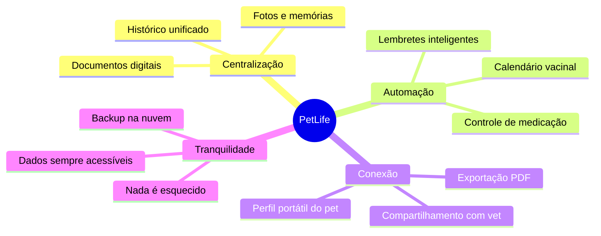
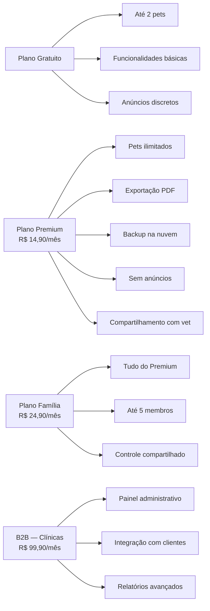
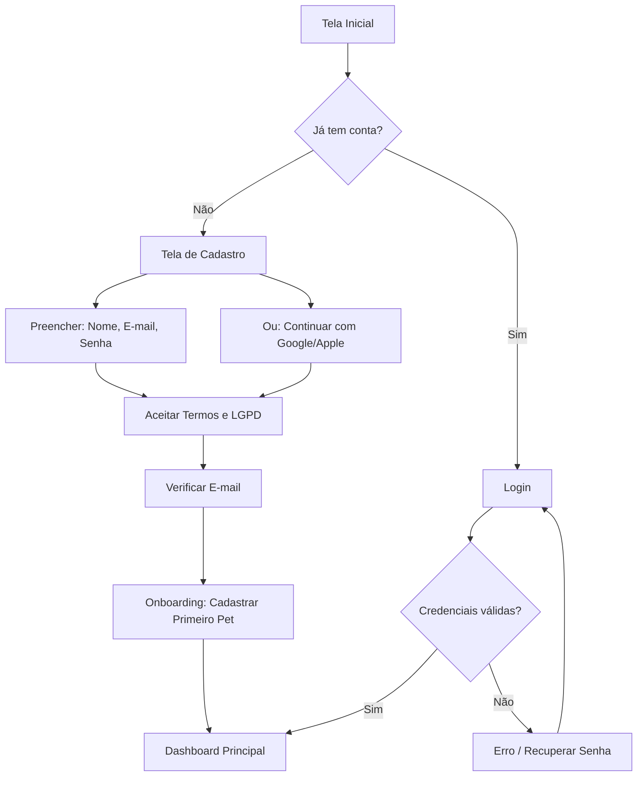
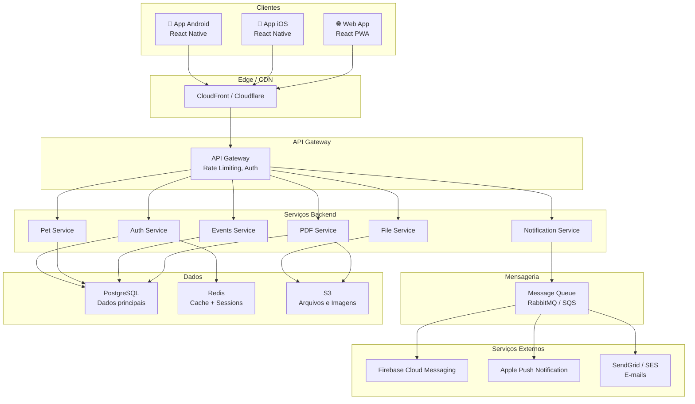
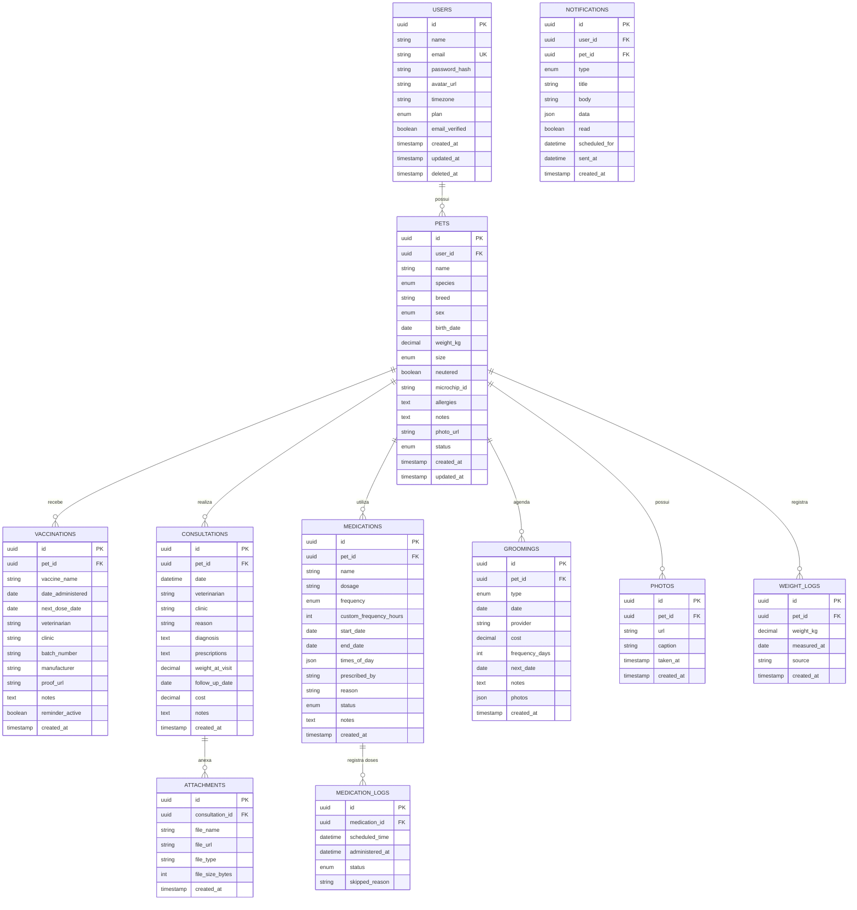
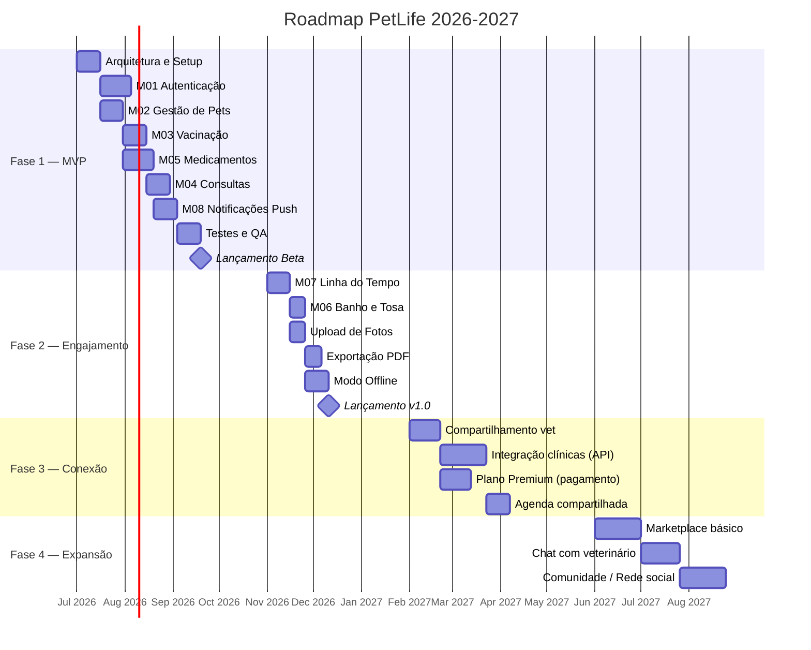

# 📋 PRD — PetLife

## Documento de Requisitos do Produto (Product Requirements Document)

> **Versão:** 2.0  
> **Data:** 16 de Junho de 2026  
> **Status:** Em Revisão  
> **Classificação:** Confidencial  

---

# 1. Visão Geral do Produto

## 1.1 Identidade

| Campo | Descrição |
|---|---|
| **Nome do Produto** | PetLife |
| **Tagline** | *Toda a vida do seu pet em um só lugar* |
| **Tipo** | Aplicativo multiplataforma (Android, iOS e Web) |
| **Versão Alvo do MVP** | 1.0.0 |
| **Horizonte do Produto** | 3 anos (2026–2029) |

## 1.2 Visão do Produto

Ser a plataforma de referência no Brasil para gestão completa da vida de animais de estimação, conectando tutores, veterinários e prestadores de serviços em um ecossistema digital integrado, seguro e inteligente.

## 1.3 Missão

Centralizar o histórico de saúde, desenvolvimento e rotina dos animais de estimação em uma plataforma única e acessível, permitindo que tutores acompanhem informações importantes, recebam lembretes automáticos sobre cuidados essenciais e compartilhem dados com profissionais de forma segura.

## 1.4 Proposta de Valor

---

# 2. Problema e Contexto

## 2.1 Declaração do Problema

As informações relacionadas aos pets estão dispersas entre carteiras físicas de vacinação, documentos veterinários impressos, aplicativos genéricos de anotações, lembretes manuais em calendários pessoais e galerias de fotos desorganizadas.

## 2.2 Impactos da Fragmentação

| Área Afetada | Impacto | Gravidade |
|---|---|---|
| **Saúde do animal** | Perda de prazos de vacinação e reforços | 🔴 Crítico |
| **Controle medicamentoso** | Doses esquecidas ou duplicadas | 🔴 Crítico |
| **Rotina de cuidados** | Falta de organização para banho, tosa e consultas | 🟡 Moderado |
| **Emergências veterinárias** | Impossibilidade de acessar histórico rapidamente | 🔴 Crítico |
| **Múltiplos pets** | Confusão entre registros de diferentes animais | 🟡 Moderado |
| **Mudança de veterinário** | Perda de continuidade no tratamento | 🟠 Alto |

## 2.3 Contexto de Mercado

- O Brasil possui a **3ª maior população de animais de estimação do mundo** (estimativa de 160 milhões de pets em 2026).
- O mercado pet brasileiro movimenta mais de **R$ 70 bilhões/ano** e cresce a taxas de 12–15% ao ano.
- A digitalização do setor pet ainda é incipiente — a maioria dos tutores usa métodos analógicos para gerenciar a saúde do animal.
- Concorrentes internacionais (PetDesk, 11pets, Petable) não possuem forte presença no Brasil e não atendem às particularidades regulatórias locais (LGPD).

## 2.4 Análise Competitiva

| Competidor | Plataformas | Pontos Fortes | Pontos Fracos | Posição |
|---|---|---|---|---|
| **11pets** | Android, iOS | UI simples, multi-pet | Sem backend robusto, offline-first | Internacional |
| **Petable** | Android, iOS | Lembretes, rastreamento de peso | Interface datada, sem PDF export | Internacional |
| **PetDesk** | Android, iOS, Web | Integração com clínicas | Focado no mercado EUA | EUA |
| **DogLog** | iOS | Compartilhamento familiar | Apenas iOS, apenas cães | EUA |
| **PetLife** | Android, iOS, Web | Ecossistema completo BR, LGPD, escalável | Novo no mercado | 🇧🇷 Brasil |

---

# 3. Objetivos de Negócio

## 3.1 Objetivos Estratégicos

| ID | Objetivo | Horizonte | Métrica-Alvo |
|---|---|---|---|
| OE-01 | Validar product-market fit no mercado brasileiro | 6 meses | NPS ≥ 40 |
| OE-02 | Construir base crítica de usuários | 12 meses | 50.000 usuários ativos |
| OE-03 | Atingir sustentabilidade financeira | 18 meses | MRR ≥ R$ 100.000 |
| OE-04 | Estabelecer parcerias com clínicas veterinárias | 24 meses | 200 clínicas integradas |
| OE-05 | Tornar-se referência em gestão pet digital no Brasil | 36 meses | 500.000 MAU |

## 3.2 Modelo de Monetização

---

# 4. Público-Alvo e Personas

## 4.1 Segmentação

### Público Primário
- Tutores de cães e gatos, classe B e C, 25–45 anos, residentes em centros urbanos.

### Público Secundário
- Criadores profissionais e amadores.
- Clínicas e consultórios veterinários.
- Adestradores e pet sitters.
- ONGs e protetores independentes de animais.

## 4.2 Personas Detalhadas

### Persona 1 — Camila, a Tutora Dedicada
| Atributo | Detalhe |
|---|---|
| **Idade** | 32 anos |
| **Localização** | São Paulo, SP |
| **Ocupação** | Analista de Marketing |
| **Pets** | 1 cachorra (Luna, SRD, 3 anos) |
| **Comportamento digital** | Smartphone Android, usa apps diariamente |
| **Dor principal** | Esquece datas de vacina e perde comprovantes |
| **Motivação** | Quer garantir que Luna tenha todos os cuidados em dia |
| **Quote** | *"Já perdi a carteirinha de vacinação da Luna duas vezes"* |

### Persona 2 — Roberto, o Tutor Multiespécie
| Atributo | Detalhe |
|---|---|
| **Idade** | 45 anos |
| **Localização** | Belo Horizonte, MG |
| **Ocupação** | Engenheiro Civil |
| **Pets** | 2 cães + 1 gato |
| **Comportamento digital** | iPhone, organizado, usa planilhas |
| **Dor principal** | Confunde registros entre os 3 pets |
| **Motivação** | Quer um sistema centralizado e confiável |
| **Quote** | *"Minha planilha de controle já ficou grande demais"* |

### Persona 3 — Dra. Fernanda, a Veterinária
| Atributo | Detalhe |
|---|---|
| **Idade** | 38 anos |
| **Localização** | Curitiba, PR |
| **Ocupação** | Veterinária, clínica própria |
| **Dor principal** | Pacientes chegam sem histórico atualizado |
| **Motivação** | Quer acesso rápido ao histórico dos pets atendidos |
| **Quote** | *"Se o tutor trouxesse o histórico organizado, a consulta seria muito mais produtiva"* |

### Persona 4 — Mariana, a Protetora de Animais
| Atributo | Detalhe |
|---|---|
| **Idade** | 28 anos |
| **Localização** | Recife, PE |
| **Ocupação** | Voluntária em ONG de proteção animal |
| **Pets sob cuidado** | 15+ animais em trânsito |
| **Dor principal** | Gerenciar saúde de muitos animais simultaneamente |
| **Motivação** | Precisa de controle rápido e portátil |
| **Quote** | *"Cada animal resgatado chega sem nenhum registro"* |

---

# 5. Indicadores de Sucesso (KPIs)

## 5.1 Métricas do MVP

| ID | Métrica | Meta | Método de Medição |
|---|---|---|---|
| KPI-01 | Taxa de ativação (completar onboarding + cadastrar 1 pet) | ≥ 60% | Analytics de funil |
| KPI-02 | Cadastro de ≥1 pet por usuário | ≥ 80% | Contagem de registros |
| KPI-03 | Retenção D7 | ≥ 45% | Cohort analysis |
| KPI-04 | Retenção D30 | ≥ 35% | Cohort analysis |
| KPI-05 | Taxa de abertura de notificações push | ≥ 25% | Firebase / OneSignal |
| KPI-06 | Média de registros/pet no 1º mês | ≥ 5 | Contagem por pet |
| KPI-07 | NPS (Net Promoter Score) | ≥ 40 | Pesquisa in-app |
| KPI-08 | Crash-free rate | ≥ 99,5% | Crashlytics / Sentry |
| KPI-09 | Tempo médio de carregamento de telas | < 2s | Performance monitoring |

## 5.2 Métricas de Crescimento (Pós-MVP)

| Métrica | Meta 6 meses | Meta 12 meses |
|---|---|---|
| MAU (Monthly Active Users) | 10.000 | 50.000 |
| Conversão Free → Premium | 5% | 8% |
| MRR | R$ 20.000 | R$ 100.000 |
| Avaliação nas lojas | ≥ 4.5 ⭐ | ≥ 4.6 ⭐ |

---

# 6. Escopo do MVP

## 6.1 Incluído no MVP

| Módulo | Funcionalidade | Prioridade |
|---|---|---|
| Autenticação | Cadastro, login, recuperação de senha | 🔴 P0 |
| Gestão de Pets | Cadastro de múltiplos pets com dados completos | 🔴 P0 |
| Vacinação | Registro de vacinas, reforços, comprovantes | 🔴 P0 |
| Medicamentos | Controle de dosagem, horários, administração | 🔴 P0 |
| Consultas | Registro de consultas, diagnósticos, prescrições | 🔴 P0 |
| Banho e Tosa | Registro de procedimentos, periodicidade | 🟡 P1 |
| Fotos | Upload e galeria de fotos do pet | 🟡 P1 |
| Linha do Tempo | Consolidação cronológica de todos os eventos | 🟡 P1 |
| Notificações | Lembretes push para vacinas, remédios, consultas | 🔴 P0 |
| Exportação PDF | Geração de relatório completo do pet | 🟡 P1 |

## 6.2 Fora do MVP (Roadmap Futuro)

| Funcionalidade | Fase Planejada | Justificativa |
|---|---|---|
| Marketplace de serviços | Fase 4 | Complexidade de integração e operação |
| Telemedicina veterinária | Fase 4 | Requer parcerias e regulamentação |
| Integração com clínicas | Fase 3 | Depende de base de usuários estabelecida |
| Integração com dispositivos IoT | Fase 5 | Mercado ainda emergente no Brasil |
| Rede social / comunidade | Fase 4 | Risco de dispersão de foco |
| Chat com veterinários | Fase 3 | Requer modelo de negócios definido |
| IA para diagnósticos | Fase 5 | Requer base de dados robusta e validação científica |
| Integração com planos de saúde pet | Fase 4 | Depende de parcerias B2B |

---

# 7. Módulos do Sistema — Especificação Detalhada

## M01 — Autenticação e Conta

### 7.1.1 Descrição
Módulo responsável por todo o ciclo de vida da conta do usuário, desde o cadastro até a exclusão, garantindo segurança e conformidade com a LGPD.

### 7.1.2 Funcionalidades

| ID | Funcionalidade | Descrição | Prioridade |
|---|---|---|---|
| M01-F01 | Cadastro de usuário | Registro via e-mail/senha ou OAuth (Google, Apple) | P0 |
| M01-F02 | Login | Autenticação com e-mail/senha ou OAuth | P0 |
| M01-F03 | Recuperação de senha | Fluxo de reset via e-mail com token temporário | P0 |
| M01-F04 | Edição de perfil | Alterar nome, foto, e-mail, senha | P1 |
| M01-F05 | Exclusão de conta | Remoção completa de dados (LGPD Art. 18) | P0 |
| M01-F06 | Login biométrico | Face ID / Fingerprint para acesso rápido | P2 |
| M01-F07 | Termos e privacidade | Aceite obrigatório de LGPD e termos de uso | P0 |

### 7.1.3 Fluxo de Cadastro

### 7.1.4 Critérios de Aceitação

- [ ] Usuário pode criar conta com e-mail e senha (mínimo 8 caracteres, 1 maiúscula, 1 número).
- [ ] Usuário pode criar conta via Google OAuth 2.0.
- [ ] Usuário pode criar conta via Apple Sign-In.
- [ ] E-mail de verificação é enviado em até 30 segundos após o cadastro.
- [ ] Senha é armazenada usando bcrypt com salt de 12 rounds.
- [ ] Token JWT expira em 24 horas com refresh token de 30 dias.
- [ ] Usuário pode solicitar exclusão completa de conta e todos os dados em até 72 horas.
- [ ] Fluxo de recuperação de senha gera token com expiração de 15 minutos.

---

## M02 — Gestão de Pets

### 7.2.1 Descrição
Módulo central do aplicativo que permite ao tutor cadastrar, editar e gerenciar o perfil completo de seus animais de estimação.

### 7.2.2 Modelo de Dados do Pet

| Campo | Tipo | Obrigatório | Validação |
|---|---|---|---|
| `id` | UUID v4 | Auto | — |
| `user_id` | UUID v4 | Sim | FK → Users |
| `name` | String(100) | Sim | Mín. 2 caracteres |
| `species` | Enum | Sim | `dog`, `cat`, `bird`, `fish`, `rodent`, `reptile`, `other` |
| `breed` | String(100) | Não | Sugestão por autocomplete |
| `sex` | Enum | Sim | `male`, `female`, `unknown` |
| `birth_date` | Date | Não | Não pode ser data futura |
| `weight_kg` | Decimal(5,2) | Não | 0.01 – 200.00 |
| `size` | Enum | Não | `mini`, `small`, `medium`, `large`, `giant` |
| `neutered` | Boolean | Não | Default: false |
| `microchip_id` | String(50) | Não | — |
| `allergies` | Text | Não | — |
| `notes` | Text | Não | Máx. 2000 caracteres |
| `photo_url` | String(500) | Não | URL válida ou Base64 |
| `status` | Enum | Auto | `active`, `archived`, `deceased` |
| `created_at` | Timestamp | Auto | — |
| `updated_at` | Timestamp | Auto | — |

### 7.2.3 Funcionalidades

| ID | Funcionalidade | Descrição | Prioridade |
|---|---|---|---|
| M02-F01 | Cadastro de pet | Formulário com todos os campos acima | P0 |
| M02-F02 | Edição de dados | Alterar qualquer campo do perfil | P0 |
| M02-F03 | Múltiplos pets | Sem limite na conta Premium, até 2 no plano Free | P0 |
| M02-F04 | Upload de foto | Captura por câmera ou seleção da galeria | P1 |
| M02-F05 | Arquivamento | Ocultar perfil sem excluir dados (ex: pet falecido) | P1 |
| M02-F06 | QR Code do pet | Gerar QR com identificação para coleira | P2 |
| M02-F07 | Compartilhamento de perfil | Compartilhar perfil do pet com outro usuário | P2 |

### 7.2.4 Critérios de Aceitação

- [ ] Tutor pode cadastrar um pet preenchendo ao menos nome e espécie.
- [ ] Foto do pet é comprimida para máx. 500KB antes do upload.
- [ ] Lista de raças é carregada dinamicamente por espécie selecionada.
- [ ] Pet arquivado não aparece na lista principal, mas pode ser restaurado.
- [ ] Ao excluir um pet, todos os registros associados são removidos (cascade).

---

## M03 — Vacinação

### 7.3.1 Descrição
Módulo para registro e controle completo do calendário vacinal de cada pet, incluindo reforços automáticos e anexo de comprovantes digitais.

### 7.3.2 Modelo de Dados

| Campo | Tipo | Obrigatório | Validação |
|---|---|---|---|
| `id` | UUID v4 | Auto | — |
| `pet_id` | UUID v4 | Sim | FK → Pets |
| `vaccine_name` | String(200) | Sim | Autocomplete com vacinas padrão |
| `date_administered` | Date | Sim | Não pode ser data futura |
| `next_dose_date` | Date | Não | Deve ser ≥ date_administered |
| `veterinarian` | String(200) | Não | — |
| `clinic` | String(200) | Não | — |
| `batch_number` | String(50) | Não | Lote da vacina |
| `manufacturer` | String(200) | Não | — |
| `proof_url` | String(500) | Não | Imagem do comprovante |
| `notes` | Text | Não | — |
| `reminder_active` | Boolean | Auto | Default: true |
| `created_at` | Timestamp | Auto | — |

### 7.3.3 Vacinas Pré-cadastradas

**Cães:**
- V8 / V10 (Polivalente) — Reforço anual
- Antirrábica — Reforço anual
- Gripe Canina (Bordetella) — Reforço anual
- Giardíase — Reforço anual
- Leishmaniose — Reforço anual

**Gatos:**
- V3 / V4 / V5 (Tríplice/Quádrupla/Quíntupla) — Reforço anual
- Antirrábica — Reforço anual
- FeLV (Leucemia Felina) — Reforço anual

### 7.3.4 Critérios de Aceitação

- [ ] Tutor pode registrar uma vacina com nome, data e opcionalmente veterinário/clínica.
- [ ] Sistema sugere vacinas pré-cadastradas com autocomplete baseado na espécie do pet.
- [ ] Ao registrar vacina com periodicidade conhecida, o sistema calcula a próxima dose automaticamente.
- [ ] Notificação push é enviada 7 dias antes e no dia da próxima dose.
- [ ] Comprovante pode ser anexado via foto (câmera ou galeria).
- [ ] Histórico vacinal é exibido em ordem cronológica reversa (mais recente primeiro).

---

## M04 — Consultas Veterinárias

### 7.4.1 Descrição
Módulo para registro completo de consultas veterinárias, incluindo diagnósticos, prescrições, exames anexados e agendamento de retornos.

### 7.4.2 Modelo de Dados

| Campo | Tipo | Obrigatório | Validação |
|---|---|---|---|
| `id` | UUID v4 | Auto | — |
| `pet_id` | UUID v4 | Sim | FK → Pets |
| `date` | DateTime | Sim | — |
| `veterinarian` | String(200) | Não | — |
| `clinic` | String(200) | Não | — |
| `reason` | String(500) | Sim | Motivo da consulta |
| `diagnosis` | Text | Não | — |
| `prescriptions` | Text | Não | — |
| `weight_at_visit` | Decimal(5,2) | Não | Atualiza peso do pet |
| `follow_up_date` | Date | Não | — |
| `cost` | Decimal(10,2) | Não | R$ |
| `attachments` | JSON Array | Não | URLs de exames/documentos |
| `notes` | Text | Não | — |
| `created_at` | Timestamp | Auto | — |

### 7.4.3 Critérios de Aceitação

- [ ] Tutor pode registrar consulta com data e motivo no mínimo.
- [ ] Múltiplos documentos/exames podem ser anexados (máx. 5 por consulta, 2MB cada).
- [ ] Se o peso é informado na consulta, o perfil do pet é atualizado automaticamente.
- [ ] Se data de retorno é informada, um lembrete é criado automaticamente.
- [ ] Consultas são exibidas na linha do tempo geral do pet.

---

## M05 — Controle de Medicamentos

### 7.5.1 Descrição
Módulo para gerenciamento completo de tratamentos medicamentosos, com controle de dosagem, horários e acompanhamento de administração.

### 7.5.2 Modelo de Dados

| Campo | Tipo | Obrigatório | Validação |
|---|---|---|---|
| `id` | UUID v4 | Auto | — |
| `pet_id` | UUID v4 | Sim | FK → Pets |
| `name` | String(200) | Sim | Nome do medicamento |
| `dosage` | String(100) | Sim | Ex: "1 comprimido de 50mg" |
| `frequency` | Enum | Sim | `once`, `daily`, `twice_daily`, `every_8h`, `every_12h`, `weekly`, `custom` |
| `custom_frequency_hours` | Integer | Condicional | Se frequency = custom |
| `start_date` | Date | Sim | — |
| `end_date` | Date | Não | — |
| `times_of_day` | JSON Array | Sim | Ex: ["08:00", "20:00"] |
| `prescribed_by` | String(200) | Não | — |
| `reason` | String(500) | Não | — |
| `status` | Enum | Auto | `active`, `completed`, `cancelled` |
| `notes` | Text | Não | — |
| `created_at` | Timestamp | Auto | — |

### 7.5.3 Modelo de Dados — Registro de Administração

| Campo | Tipo | Obrigatório |
|---|---|---|
| `id` | UUID v4 | Auto |
| `medication_id` | UUID v4 | Sim |
| `scheduled_time` | DateTime | Auto |
| `administered_at` | DateTime | Não |
| `status` | Enum | Auto |
| `skipped_reason` | String(500) | Não |

> Status possíveis: `pending`, `taken`, `skipped`, `late`

### 7.5.4 Critérios de Aceitação

- [ ] Tutor pode cadastrar medicamento com nome, dosagem e horários.
- [ ] Sistema gera automaticamente os registros de administração pendentes para cada horário.
- [ ] Notificação push é enviada no horário configurado para cada dose.
- [ ] Tutor pode marcar dose como "tomada", "pulada" (com motivo) ou "atrasada".
- [ ] Dashboard mostra porcentagem de aderência ao tratamento.
- [ ] Tratamento pode ser encerrado manualmente ou automaticamente ao atingir a data final.

---

## M06 — Banho e Tosa

### 7.6.1 Descrição
Módulo para controle de procedimentos estéticos e higiênicos, com periodicidade configurável e lembretes automáticos.

### 7.6.2 Modelo de Dados

| Campo | Tipo | Obrigatório | Validação |
|---|---|---|---|
| `id` | UUID v4 | Auto | — |
| `pet_id` | UUID v4 | Sim | FK → Pets |
| `type` | Enum | Sim | `bath`, `grooming`, `bath_and_grooming` |
| `date` | Date | Sim | — |
| `provider` | String(200) | Não | Pet shop / Groomer |
| `cost` | Decimal(10,2) | Não | R$ |
| `frequency_days` | Integer | Não | Periodicidade em dias |
| `next_date` | Date | Auto | Calculado: date + frequency_days |
| `notes` | Text | Não | — |
| `photos` | JSON Array | Não | Antes/depois |
| `created_at` | Timestamp | Auto | — |

### 7.6.3 Critérios de Aceitação

- [ ] Tutor pode registrar banho, tosa ou ambos com data.
- [ ] Se periodicidade é definida, o sistema calcula a próxima data e cria lembrete.
- [ ] Fotos antes/depois podem ser anexadas ao registro.
- [ ] Histórico exibe todos os procedimentos em ordem cronológica.

---

## M07 — Linha do Tempo

### 7.7.1 Descrição
Módulo de visualização que consolida todos os eventos do pet em uma linha do tempo cronológica unificada, permitindo ao tutor ter uma visão completa da vida do animal.

### 7.7.2 Tipos de Evento na Linha do Tempo

| Tipo | Ícone | Cor | Fonte |
|---|---|---|---|
| Vacina aplicada | 💉 | Verde | M03 |
| Consulta veterinária | 🩺 | Azul | M04 |
| Medicamento iniciado | 💊 | Roxo | M05 |
| Medicamento encerrado | ✅ | Cinza | M05 |
| Banho e Tosa | ✂️ | Rosa | M06 |
| Foto adicionada | 📷 | Amber | Upload |
| Peso atualizado | ⚖️ | Teal | M02/M04 |
| Aniversário | 🎂 | Dourado | M02 (calculado) |

### 7.7.3 Critérios de Aceitação

- [ ] Linha do tempo carrega com scroll infinito (20 eventos por página).
- [ ] Eventos são exibidos em ordem cronológica reversa (mais recente no topo).
- [ ] Cada evento mostra ícone, tipo, data, resumo e foto (se existir).
- [ ] Tutor pode filtrar por tipo de evento.
- [ ] Tutor pode navegar para o detalhe do evento ao tocar nele.
- [ ] Aniversários do pet são gerados automaticamente a cada ano.

---

## M08 — Notificações e Lembretes

### 7.8.1 Descrição
Sistema transversal de notificações que garante que o tutor nunca perca um compromisso importante com a saúde e cuidados do pet.

### 7.8.2 Tipos de Notificação

| Tipo | Gatilho | Antecedência | Canal |
|---|---|---|---|
| Vacina próxima | `next_dose_date` da vacina | 7 dias + dia D | Push + In-App |
| Dose de medicamento | `times_of_day` do medicamento | No horário | Push + In-App |
| Consulta de retorno | `follow_up_date` da consulta | 3 dias + dia D | Push + In-App |
| Banho/Tosa agendado | `next_date` do procedimento | 2 dias + dia D | Push + In-App |
| Aniversário do pet | `birth_date` do pet | No dia | Push + In-App |
| Dose não registrada | Medicamento pendente sem registro | 30 min após horário | Push |

### 7.8.3 Regras de Negócio

- Notificações respeitam o horário local do usuário (timezone).
- Limite de 5 notificações push por dia para evitar fadiga.
- Usuário pode desativar tipos específicos de notificação nas configurações.
- Notificações in-app ficam armazenadas por 30 dias na central.
- Horários de "não perturbe" (ex: 22h–7h) são respeitados, exceto para medicamentos marcados como "urgentes".

### 7.8.4 Critérios de Aceitação

- [ ] Push notifications funcionam com o app fechado (Android e iOS).
- [ ] Tutor pode ativar/desativar cada tipo de notificação individualmente.
- [ ] Central de notificações exibe todas as notificações recentes com status (lida/não lida).
- [ ] Notificações de medicamento incluem botão de ação rápida "Marcar como tomado".
- [ ] Respeita fuso horário do dispositivo do usuário.

---

# 8. Requisitos Funcionais Detalhados

| ID | Requisito | Módulo | Prioridade | Critério de Aceite |
|---|---|---|---|---|
| RF-001 | O sistema deve permitir cadastro e autenticação de usuários via e-mail/senha e OAuth | M01 | P0 | Login bem-sucedido em < 3s |
| RF-002 | O sistema deve permitir cadastro de múltiplos pets por usuário | M02 | P0 | Até 2 pets (Free), ilimitado (Premium) |
| RF-003 | O sistema deve permitir registrar vacinas com data, nome, veterinário e comprovante | M03 | P0 | Vacina visível na timeline após salvar |
| RF-004 | O sistema deve enviar notificações push baseadas em datas configuradas | M08 | P0 | Push recebido com app fechado |
| RF-005 | O sistema deve permitir anexar imagens e documentos (JPEG, PNG, PDF) | Todos | P1 | Upload < 5s para arquivos até 2MB |
| RF-006 | O sistema deve consolidar eventos em linha do tempo cronológica | M07 | P1 | Timeline carrega em < 2s |
| RF-007 | O sistema deve permitir editar e excluir qualquer registro | Todos | P0 | Confirmação antes de excluir |
| RF-008 | O sistema deve gerar relatório PDF com histórico completo do pet | M07 | P1 | PDF inclui todos os registros e dados do pet |
| RF-009 | O sistema deve registrar consultas veterinárias com diagnóstico e prescrição | M04 | P0 | Campos opcionais não bloqueiam o salvamento |
| RF-010 | O sistema deve controlar medicamentos com dosagem, frequência e horários | M05 | P0 | Notificação enviada no horário configurado |
| RF-011 | O sistema deve registrar procedimentos de banho e tosa | M06 | P1 | Cálculo automático da próxima data |
| RF-012 | O sistema deve funcionar offline com sincronização posterior | Todos | P1 | Dados locais sincronizam ao reconectar |
| RF-013 | O sistema deve permitir busca e filtros em todos os registros | Todos | P2 | Resultados em < 1s |
| RF-014 | O sistema deve suportar múltiplos idiomas (PT-BR inicialmente) | Todos | P2 | Textos externalizados em arquivos i18n |

---

# 9. Requisitos Não Funcionais

## RNF-001 — Segurança

| Requisito | Especificação |
|---|---|
| Criptografia em trânsito | TLS 1.3 para todas as comunicações |
| Criptografia em repouso | AES-256 para dados sensíveis no banco |
| Autenticação | JWT com RS256, access token (15min), refresh token (30 dias) |
| Senhas | bcrypt com salt de 12 rounds |
| Rate limiting | Máx. 100 req/min por usuário, 5 tentativas de login/5min |
| OWASP | Proteção contra Top 10 (XSS, CSRF, SQL Injection, etc.) |
| Auditoria | Log de todas as operações de escrita com timestamp e user_id |

## RNF-002 — LGPD e Privacidade

| Requisito | Referência LGPD |
|---|---|
| Consentimento explícito no cadastro | Art. 7º, I |
| Acesso aos dados pessoais pelo titular | Art. 18, II |
| Correção de dados incompletos ou inexatos | Art. 18, III |
| Portabilidade dos dados (exportação) | Art. 18, V |
| Eliminação dos dados (exclusão de conta) | Art. 18, VI |
| Registro de consentimento com timestamp | Art. 8º, §2 |
| Política de privacidade acessível | Art. 9º |
| Notificação de incidentes de segurança | Art. 48 |
| Nomeação de Encarregado (DPO) | Art. 41 |

## RNF-003 — Disponibilidade

| Métrica | SLA |
|---|---|
| Uptime da API | ≥ 99,5% (mensal) |
| Uptime do CDN | ≥ 99,9% |
| RPO (Recovery Point Objective) | ≤ 1 hora |
| RTO (Recovery Time Objective) | ≤ 4 horas |
| Janela de manutenção | Máx. 2h/mês, fora do horário de pico (2h–5h BRT) |

## RNF-004 — Performance

| Operação | SLA de Tempo |
|---|---|
| Login / Cadastro | < 2 segundos |
| Listagem de pets | < 1 segundo |
| Registro de evento | < 1,5 segundo |
| Upload de imagem (2MB) | < 5 segundos |
| Geração de PDF | < 10 segundos |
| Carregamento de timeline (20 itens) | < 2 segundos |
| Busca / Filtros | < 1 segundo |

## RNF-005 — Escalabilidade

| Dimensão | Capacidade Inicial | Meta 12 meses | Estratégia |
|---|---|---|---|
| Usuários simultâneos | 500 | 10.000 | Auto-scaling horizontal |
| Pets cadastrados | 10.000 | 500.000 | Sharding por user_id |
| Arquivos armazenados | 50 GB | 5 TB | Object storage (S3-compatible) |
| Requisições/segundo | 100 | 5.000 | Load balancer + cache |

## RNF-006 — Compatibilidade Multiplataforma

| Plataforma | Versão Mínima | Framework |
|---|---|---|
| Android | 8.0 (API 26) | React Native |
| iOS | 14.0 | React Native |
| Web (Desktop) | Chrome 90+, Firefox 90+, Safari 15+, Edge 90+ | React (PWA) |
| Web (Mobile) | Mesmos browsers acima | React (PWA) responsivo |

## RNF-007 — Usabilidade e Acessibilidade

| Requisito | Especificação |
|---|---|
| Onboarding completo | ≤ 5 minutos (cadastro + primeiro pet) |
| Registro de evento | ≤ 3 taps/cliques |
| Acessibilidade | WCAG 2.1 nível AA |
| Tamanho de fonte mínimo | 14px |
| Contraste mínimo | 4.5:1 (texto normal), 3:1 (texto grande) |
| Suporte a screen readers | VoiceOver (iOS), TalkBack (Android) |
| Modo escuro | Suportado nativamente |

## RNF-008 — Observabilidade

| Componente | Ferramenta |
|---|---|
| Logs estruturados | Structured logging (JSON) com correlação de request |
| Métricas de aplicação | Prometheus + Grafana |
| Tracing distribuído | OpenTelemetry |
| Crash reporting | Sentry |
| Analytics de produto | Mixpanel ou Amplitude |
| Monitoramento de uptime | UptimeRobot ou similar |
| Alertas | PagerDuty ou Slack webhooks |

---

# 10. Arquitetura Técnica

## 10.1 Visão Geral da Arquitetura

## 10.2 Stack Tecnológica Recomendada

| Camada | Tecnologia | Justificativa |
|---|---|---|
| **Mobile** | React Native 0.76+ | Codebase único para Android e iOS, ecossistema maduro |
| **Web** | React 19 + Vite | PWA com performance excelente e compartilhamento de código com RN |
| **Design System** | Atomic Design com Vanilla CSS | Abordagem modular de design baseada em componentes (Atoms, Molecules, Organisms) usando Vanilla CSS |
| **Backend** | Java 21 + Spring Boot 4.1.0 (Maven 3.9.9) | Robustez, segurança nativa, ecossistema corporativo maduro, suporte a Spring Security |
| **ORM / Migrations** | Hibernate 6.6.0 + Spring Data JPA / Flyway 10.20.0 | Mapeamento relacional maduro com controle rígido de migrations em SQL |
| **Banco de Dados** | PostgreSQL 16.4 | Robustez, conformidade ACID, excelente suporte a JSON e UUID v4 |
| **Cache** | Redis 7.4.0 | Armazenamento de sessões, rate limiting e cache de dados de leitura frequente |
| **Object Storage** | AWS S3 / MinIO | Armazenamento escalável e seguro para imagens de pets e PDFs |
| **Mensageria** | RabbitMQ 4.0.0 | Processamento assíncrono de notificações push e e-mails via filas |
| **Push Notifications** | Firebase Cloud Messaging | Integração multiplataforma (Android e iOS via APNs) para notificações |
| **CI/CD** | GitHub Actions | Automação de build, testes e deploy |
| **Infraestrutura** | AWS / GCP (Terraform) | Infraestrutura como código, auto-scaling |
| **Monitoramento** | Sentry + Grafana + Prometheus | Observabilidade completa |

## 10.3 Modelo de Dados Relacional (ERD)

## 10.4 Especificação de API (Endpoints Principais)

### Autenticação
| Método | Endpoint | Descrição |
|---|---|---|
| `POST` | `/api/v1/auth/register` | Cadastro de novo usuário |
| `POST` | `/api/v1/auth/login` | Login com e-mail/senha |
| `POST` | `/api/v1/auth/oauth/google` | Login via Google |
| `POST` | `/api/v1/auth/oauth/apple` | Login via Apple |
| `POST` | `/api/v1/auth/forgot-password` | Solicitar reset de senha |
| `POST` | `/api/v1/auth/reset-password` | Redefinir senha com token |
| `POST` | `/api/v1/auth/refresh` | Renovar access token |
| `DELETE` | `/api/v1/auth/account` | Excluir conta (LGPD) |

### Pets
| Método | Endpoint | Descrição |
|---|---|---|
| `GET` | `/api/v1/pets` | Listar pets do usuário |
| `POST` | `/api/v1/pets` | Cadastrar novo pet |
| `GET` | `/api/v1/pets/:id` | Detalhe do pet |
| `PUT` | `/api/v1/pets/:id` | Atualizar pet |
| `PATCH` | `/api/v1/pets/:id/archive` | Arquivar/desarquivar pet |
| `DELETE` | `/api/v1/pets/:id` | Excluir pet (cascade) |
| `GET` | `/api/v1/pets/:id/timeline` | Timeline do pet |
| `GET` | `/api/v1/pets/:id/report/pdf` | Gerar PDF do histórico |

### Vacinas
| Método | Endpoint | Descrição |
|---|---|---|
| `GET` | `/api/v1/pets/:petId/vaccinations` | Listar vacinas |
| `POST` | `/api/v1/pets/:petId/vaccinations` | Registrar vacina |
| `PUT` | `/api/v1/pets/:petId/vaccinations/:id` | Atualizar vacina |
| `DELETE` | `/api/v1/pets/:petId/vaccinations/:id` | Excluir vacina |

### Consultas
| Método | Endpoint | Descrição |
|---|---|---|
| `GET` | `/api/v1/pets/:petId/consultations` | Listar consultas |
| `POST` | `/api/v1/pets/:petId/consultations` | Registrar consulta |
| `PUT` | `/api/v1/pets/:petId/consultations/:id` | Atualizar consulta |
| `DELETE` | `/api/v1/pets/:petId/consultations/:id` | Excluir consulta |

### Medicamentos
| Método | Endpoint | Descrição |
|---|---|---|
| `GET` | `/api/v1/pets/:petId/medications` | Listar medicamentos |
| `POST` | `/api/v1/pets/:petId/medications` | Cadastrar medicamento |
| `PUT` | `/api/v1/pets/:petId/medications/:id` | Atualizar medicamento |
| `PATCH` | `/api/v1/pets/:petId/medications/:id/close` | Encerrar tratamento |
| `POST` | `/api/v1/pets/:petId/medications/:id/logs` | Registrar dose |

### Banho e Tosa
| Método | Endpoint | Descrição |
|---|---|---|
| `GET` | `/api/v1/pets/:petId/groomings` | Listar procedimentos |
| `POST` | `/api/v1/pets/:petId/groomings` | Registrar procedimento |
| `PUT` | `/api/v1/pets/:petId/groomings/:id` | Atualizar procedimento |
| `DELETE` | `/api/v1/pets/:petId/groomings/:id` | Excluir procedimento |

### Notificações
| Método | Endpoint | Descrição |
|---|---|---|
| `GET` | `/api/v1/notifications` | Listar notificações |
| `PATCH` | `/api/v1/notifications/:id/read` | Marcar como lida |
| `PATCH` | `/api/v1/notifications/read-all` | Marcar todas como lidas |
| `PUT` | `/api/v1/notifications/settings` | Atualizar preferências |

### Upload de Arquivos
| Método | Endpoint | Descrição |
|---|---|---|
| `POST` | `/api/v1/upload` | Upload de arquivo (retorna URL) |
| `DELETE` | `/api/v1/upload/:fileId` | Excluir arquivo |

---

# 11. Backlog Completo com Critérios de Aceitação

## Épico 1 — Autenticação e Conta

| ID | User Story | Prioridade | Pontos |
|---|---|---|---|
| US-001 | Como tutor, quero criar uma conta com e-mail e senha para acessar o sistema | P0 | 5 |
| US-002 | Como tutor, quero fazer login com Google para acessar rapidamente | P0 | 3 |
| US-003 | Como tutor, quero recuperar minha senha via e-mail | P0 | 3 |
| US-004 | Como tutor, quero editar meu perfil (nome, foto, e-mail) | P1 | 3 |
| US-005 | Como tutor, quero excluir minha conta e todos os dados (LGPD) | P0 | 5 |

## Épico 2 — Gestão de Pets

| ID | User Story | Prioridade | Pontos |
|---|---|---|---|
| US-006 | Como tutor, quero cadastrar um pet com nome, espécie, raça e foto | P0 | 5 |
| US-007 | Como tutor, quero cadastrar múltiplos pets na mesma conta | P0 | 3 |
| US-008 | Como tutor, quero editar as informações do meu pet | P0 | 2 |
| US-009 | Como tutor, quero arquivar o perfil de um pet sem perder dados | P1 | 3 |
| US-010 | Como tutor, quero ver o peso do meu pet ao longo do tempo em um gráfico | P2 | 5 |

## Épico 3 — Vacinação

| ID | User Story | Prioridade | Pontos |
|---|---|---|---|
| US-011 | Como tutor, quero registrar uma vacina com nome, data e veterinário | P0 | 5 |
| US-012 | Como tutor, quero que o sistema sugira vacinas padrão para meu tipo de pet | P1 | 3 |
| US-013 | Como tutor, quero receber lembretes antes do vencimento de uma vacina | P0 | 5 |
| US-014 | Como tutor, quero anexar foto do comprovante de vacinação | P1 | 3 |
| US-015 | Como tutor, quero ver o histórico completo de vacinas do meu pet | P0 | 3 |

## Épico 4 — Consultas Veterinárias

| ID | User Story | Prioridade | Pontos |
|---|---|---|---|
| US-016 | Como tutor, quero registrar consultas com data, motivo e diagnóstico | P0 | 5 |
| US-017 | Como tutor, quero anexar exames e receitas às consultas | P1 | 5 |
| US-018 | Como tutor, quero agendar retornos e receber lembretes | P0 | 3 |
| US-019 | Como tutor, quero que o peso registrado na consulta atualize o perfil do pet | P1 | 2 |

## Épico 5 — Medicamentos

| ID | User Story | Prioridade | Pontos |
|---|---|---|---|
| US-020 | Como tutor, quero cadastrar medicamentos com dosagem e horários | P0 | 8 |
| US-021 | Como tutor, quero receber lembretes no horário de cada dose | P0 | 5 |
| US-022 | Como tutor, quero marcar doses como tomadas, puladas ou atrasadas | P0 | 5 |
| US-023 | Como tutor, quero ver a aderência ao tratamento em porcentagem | P2 | 3 |
| US-024 | Como tutor, quero encerrar um tratamento manualmente | P1 | 2 |

## Épico 6 — Banho e Tosa

| ID | User Story | Prioridade | Pontos |
|---|---|---|---|
| US-025 | Como tutor, quero registrar banho e tosa com data e pet shop | P1 | 3 |
| US-026 | Como tutor, quero definir periodicidade e receber lembretes | P1 | 3 |
| US-027 | Como tutor, quero anexar fotos antes/depois do procedimento | P2 | 3 |

## Épico 7 — Linha do Tempo e Exportação

| ID | User Story | Prioridade | Pontos |
|---|---|---|---|
| US-028 | Como tutor, quero ver todos os eventos do pet em uma linha do tempo | P1 | 8 |
| US-029 | Como tutor, quero filtrar a timeline por tipo de evento | P2 | 3 |
| US-030 | Como tutor, quero exportar o histórico completo do pet em PDF | P1 | 8 |

## Épico 8 — Notificações

| ID | User Story | Prioridade | Pontos |
|---|---|---|---|
| US-031 | Como tutor, quero configurar quais tipos de notificação desejo receber | P1 | 3 |
| US-032 | Como tutor, quero ver uma central de notificações dentro do app | P1 | 5 |
| US-033 | Como tutor, quero executar ações rápidas a partir da notificação | P2 | 5 |

**Total de Story Points do MVP:** ~148 pontos

---

# 12. Roadmap Detalhado

### Fase 1 — MVP (Jul–Out 2026)
**Objetivo:** Validar product-market fit com funcionalidades core.
- Autenticação (e-mail + Google OAuth)
- Cadastro e gestão de pets
- Registro de vacinas com reforços
- Controle de medicamentos com lembretes
- Registro de consultas veterinárias
- Push notifications

### Fase 2 — Engajamento (Nov 2026–Jan 2027)
**Objetivo:** Aumentar retenção e valor percebido.
- Linha do tempo consolidada
- Galeria de fotos do pet
- Banho e tosa
- Exportação de relatório em PDF
- Suporte offline com sincronização

### Fase 3 — Conexão (Fev–Mai 2027)
**Objetivo:** Conectar tutores com profissionais.
- Compartilhamento de perfil do pet com veterinários
- API de integração para clínicas
- Sistema de pagamento e plano Premium
- Agenda compartilhada (tutor ↔ vet)

### Fase 4 — Expansão (Jun–Dez 2027)
**Objetivo:** Criar ecossistema completo.
- Marketplace de serviços pet
- Chat com veterinários
- Comunidade / rede social de tutores
- Integração com planos de saúde pet

---

# 13. Premissas, Riscos e Mitigações

## 13.1 Premissas

| ID | Premissa | Impacto se Falsa |
|---|---|---|
| P-01 | Tutores estão dispostos a registrar dados manualmente | Baixa adoção |
| P-02 | Notificações recorrentes aumentam a retenção | Churn elevado |
| P-03 | O histórico centralizado gera valor contínuo | Baixo engajamento |
| P-04 | O mercado brasileiro está pronto para apps de gestão pet | Dificuldade de crescimento |
| P-05 | React Native entrega performance adequada em ambas as plataformas | Necessidade de rewrite nativo |

## 13.2 Riscos e Mitigações

| ID | Risco | Probabilidade | Impacto | Mitigação |
|---|---|---|---|---|
| R-01 | Alto esforço de alimentação manual desestimula uso | Alta | Alto | OCR para carteiras de vacina, templates pré-preenchidos, onboarding gamificado |
| R-02 | Baixa retenção após cadastro inicial | Média | Alto | Lembretes inteligentes, conteúdo educativo, streaks de registro |
| R-03 | Escopo excessivo no MVP | Média | Alto | Priorização rigorosa P0/P1, sprints de 2 semanas com review |
| R-04 | Complexidade de push notifications multiplataforma | Média | Médio | Firebase Cloud Messaging (suporte unificado) |
| R-05 | Custos crescentes com armazenamento de imagens | Baixa | Médio | Compressão agressiva, limites por plano, lifecycle policies no S3 |
| R-06 | Competidores internacionais entram no mercado BR | Baixa | Alto | First-mover advantage, LGPD compliance, conteúdo localizado |
| R-07 | Regulamentação específica para dados de animais | Baixa | Médio | Monitoramento regulatório, consultoria jurídica especializada |
| R-08 | Performance insuficiente do React Native | Baixa | Alto | Benchmarks antecipados, módulos nativos para operações críticas |

---

# 14. Critérios de Lançamento

## 14.1 Critérios para Beta Fechado
- [ ] Todos os módulos P0 implementados e testados
- [ ] Cobertura de testes automatizados ≥ 70%
- [ ] Zero bugs críticos (crash, perda de dados)
- [ ] Performance dentro dos SLAs definidos
- [ ] Push notifications funcionais em Android e iOS
- [ ] Conformidade LGPD validada por revisão jurídica
- [ ] 50 beta testers recrutados

## 14.2 Critérios para Lançamento Público (v1.0)
- [ ] Todos os módulos P0 e P1 implementados
- [ ] Cobertura de testes ≥ 80%
- [ ] NPS ≥ 40 entre beta testers
- [ ] Taxa de crash < 0,5%
- [ ] Aprovação nas lojas Google Play e App Store
- [ ] Landing page e estratégia de marketing definida
- [ ] Infraestrutura de monitoramento operacional
- [ ] Plano de suporte ao usuário definido

---

# 15. Glossário

| Termo | Definição |
|---|---|
| **Tutor** | Pessoa responsável pelo cuidado do animal de estimação |
| **Pet** | Animal de estimação cadastrado no sistema |
| **MVP** | Minimum Viable Product — versão mínima funcional do produto |
| **MAU** | Monthly Active Users — usuários ativos mensais |
| **MRR** | Monthly Recurring Revenue — receita recorrente mensal |
| **NPS** | Net Promoter Score — indicador de satisfação e lealdade |
| **LGPD** | Lei Geral de Proteção de Dados (Lei 13.709/2018) |
| **PWA** | Progressive Web App — aplicação web com capacidades nativas |
| **SLA** | Service Level Agreement — acordo de nível de serviço |
| **RPO** | Recovery Point Objective — quantidade máxima de perda de dados tolerável |
| **RTO** | Recovery Time Objective — tempo máximo para recuperação do sistema |
| **DPO** | Data Protection Officer — encarregado de proteção de dados |

---

> **Documento elaborado com base no PRD v1.0 original. Sujeito a revisão e aprovação dos stakeholders.**
